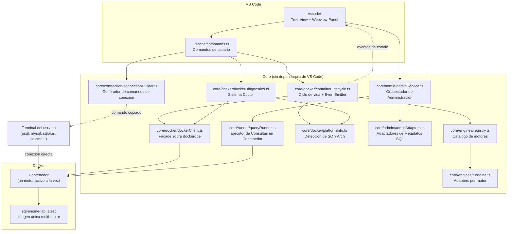
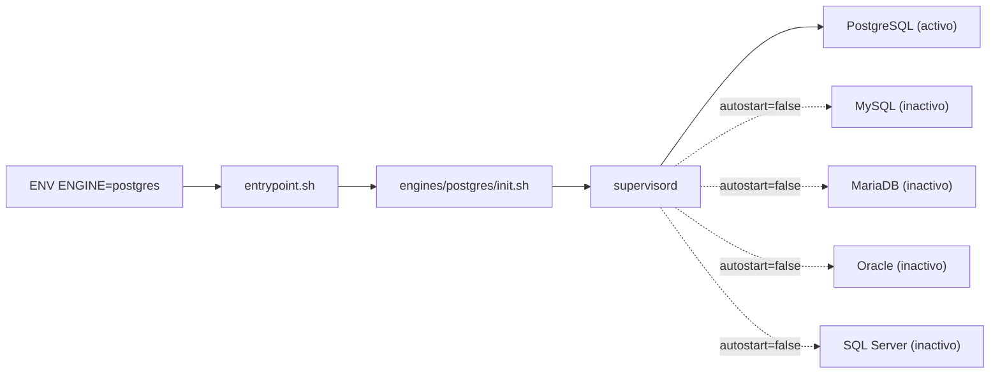

# SQL Engine Laboratory — Arquitectura

Última actualización: 2026-07-10

## Diagrama general del sistema

## Flujo de datos

1. **Usuario hace clic en "Iniciar"** en el Tree View → se ejecuta el comando `sqlEngineLab.startEngine`.
2. **`ContainerLifecycle`** consulta el `EngineRegistry` para obtener la definición del motor, luego usa `DockerClient` para pull + run del contenedor con la variable `ENGINE` correcta.
3. **`ContainerLifecycle`** emite eventos de estado (`pulling` → `starting` → `running`) que el Tree View y el Webview Panel observan para actualizar la UI.
4. **`ConnectionBuilder`** genera el comando de conexión (ej. `psql -h localhost -p 5432 -U labuser -d labdb`) usando la template del motor.
5. **Usuario copia el comando** y lo pega en cualquier terminal para conectarse al motor.
6. **Explorador Visual realiza consultas de catálogo** → La UI solicita metadatos a `AdminService`, que utiliza `AdminAdapters` para armar la query y `QueryRunner` para ejecutarla en el contenedor vía Docker socket, retornando la estructura (tablas, columnas, filas, usuarios).

## Principios de separación

| Capa | Responsabilidad | No toca |
|---|---|---|
| `vscode/` | UI, comandos, interacción con API de VS Code | Lógica de negocio, Docker |
| `core/engines/` | Definición de motores, catálogo | Docker, VS Code |
| `core/docker/` | Gestión de contenedores e imágenes | Motores específicos, VS Code |
| `core/connection/` | Generación de connection strings | Docker, VS Code |
| `core/admin/` | Administración visual (queries de catálogo, crear BDs, usuarios) | Interfaz de VS Code |
| `core/runner/` | Ejecución de consultas SQL directas en contenedor | Interfaz de VS Code |

## Imagen Docker

La imagen `sql-engine-lab` contiene 5 de los 6 motores SQL instalados (Postgres, MySQL, MariaDB, SQLite, SQL Server), pero solo uno corre a la vez. La selección se hace via la variable de entorno `ENGINE`. Internamente usa `supervisord` con `autostart=false` en todos los programas.

> [!NOTE]
> **Excepción de Arquitectura (ADR 0002):** El motor Oracle Free se ejecuta utilizando su imagen nativa (`gvenzl/oracle-free:23.5-slim`) directamente y un volumen persistente (`oracle-volume`), en lugar de la imagen unificada `sql-engine-lab`. Esto previene fallos fatales de inicialización del proceso en segundo plano (OFSD) causados por incompatibilidades con la base Debian.

