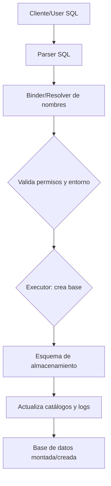
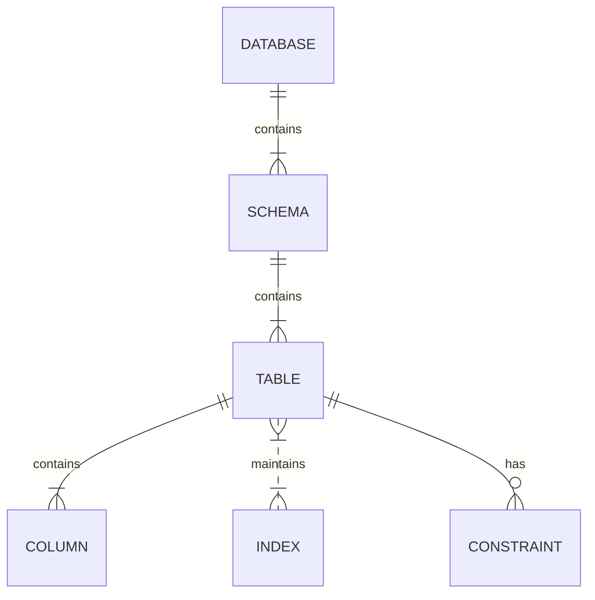

# Comparativa arquitectónica de Oracle, SQL Server, PostgreSQL, MySQL, MariaDB y SQLite

## Filosofía del proyecto  
- **Oracle Database:** Creada por Larry Ellison en 1977, Oracle es una base de datos comercial de alto rendimiento orientada a grandes empresas y operaciones críticas. Está diseñada para entornos OLTP y OLAP exigentes, con foco en fiabilidad, disponibilidad y escalabilidad. Su desarrollo (cerrado) es liderado por Oracle Corp., con extensiva documentación y soporte comercial. Aunque ofrece ediciones gratuitas (XE), su licencia es propietaria. Oracle prioriza características avanzadas (PL/SQL, particionado, replicación avanzada, índices especializados) y estabilización de operaciones masivas. Se usa típicamente en banca, telcos, ERP y grandes sistemas empresariales.  
- **Microsoft SQL Server:** Surgió en los 90 junto a Windows NT. Es un RDBMS comercial (propietario) integrado con el ecosistema Microsoft (.NET, Windows Authentication, BI). Enfocado a empresas medianas y grandes, ofrece servicios como Reporting Services, Integration Services y AlwaysOn para alta disponibilidad. Su licencia es propietaria (con ediciones Express/Developer gratuitas). Microsoft apoya una gran comunidad en torno a SQL Server, con extensa documentación oficial. Se usa en finanzas, gobierno, comercio, especialmente donde prevalece la plataforma Windows, además de Azure y Linux hoy en día.  
- **PostgreSQL:** Nacido de Ingres en Berkeley (1986) y renombrado Postgres (1996), es un proyecto comunitario maduro (GPL/Liberal). Es la base relacional open source más avanzada, con fuerte énfasis en estándares SQL, extensibilidad (módulos, tipos personalizados), integridad de datos y funciones avanzadas (JSON, GIS, MVCC robusto, concurrencia optimista). Su licencia liberal (similar a BSD) permite libre uso comercial sin restricciones. El desarrollo es liderado por la comunidad PostgreSQL Global Development Group. Hay empresas de soporte y un gran ecosistema de extensiones. Empresas como Apple, Cisco, Facebook, Amazon (servicio Aurora PG) y muchas startups confían en PostgreSQL por su flexibilidad y estabilidad.  
- **MySQL:** Creada en 1995 por Monty Widenius, MySQL es una base de datos relacional open source enfocada en simplicidad y velocidad (originalmente para entornos web LAMP). Su edición Community es GPL (descargable gratis), pero Oracle ofrece versiones empresariales. Fue diseñada para cargas OLTP ligeras/moderadas con concurrencia manejable. Su sintaxis SQL es más limitada comparada con PG/Oracle. MySQL prioriza facilidad de uso y rendimiento en lectura/escritura básicas. Ha sido muy popular en sitios web y aplicaciones SaaS (p. ej. Facebook, Twitter migraron de MySQL a soluciones propias, pero muchos sitios web y CMS siguen usándola).  
- **MariaDB:** Nace en 2009 como fork de MySQL (por el mismo creador) tras la adquisición por Oracle, para asegurar el futuro open source. Mantiene compatibilidad con MySQL y le añade características (más motores de almacenamiento como Aria, ColumnStore; mejoras en optimizador). MariaDB Server es GPLv2. Es impulsada por la comunidad y MariaDB Corp.; ofrece ediciones de paga para soporte. Objetivo: reemplazo drop-in de MySQL, con innovación comunitaria (ej. optimizaciones de rendimiento, índices avanzados). Lo usan Wikipedia, WordPress.com, Google (internamente), y muchos migran de MySQL a MariaDB por mejoras.  
- **SQLite:** Creada en 2000 por D. Richard Hipp, es un motor SQL embebido escrito en C. Su filosofía es “ligero y autónomo”: no requiere servidor ni configuración, ocupa pocos KBs y es extremadamente fiable. Está en dominio público, integrable en cualquier app. Diseñado para almacenamiento local en dispositivos móviles, embebidos y aplicaciones de escritorio. No está pensado para alta concurrencia ni escalamiento; enfatiza economía de recursos, simplicidad y robustez (consistencia tras fallos de forma confiable). SQLite es *el motor de BD más usado en el mundo*, incorporado en smartphones, navegadores y miles de productos. Su enfoque contrasta con el de las bases de datos cliente-servidor tradicionales.

## Arquitectura del motor  
- **Oracle:** Usa una arquitectura cliente-servidor compleja. El **SGA (System Global Area)** es la memoria compartida principal, con subcomponentes: buffer cache (datos e índices en memoria), shared pool (metadatos, SQL parseados), etc. También tiene **PGA** para procesos individuales (sort, sesiones). Oracle lanza procesos de fondo (DBWR, LGWR, CKPT, etc.) que manejan escritura de buffers, registro de redo, checkpoints, limpieza (archiver, SMON, PMON), etc. Cada conexión puede usar un proceso servidor dedicado o compartido. Oracle internamente implementa su motor de consulta con parsing, optimización cost-based (CBO) y ejecución multi-hilo. En versiones modernas existe además arquitectura **multitenant** (contenedores PDB).  
- **SQL Server:** Es un servidor multi-hilo (no lanza procesos OS por conexión). El *motor de almacenamiento* corre sobre SQL OS (SQLOS) en Windows (o Linux). Usa un **Buffer Pool** global para caches de datos/índices y una caché de planes de ejecución. Cada conexión recibe uno o varios **hilos de trabajador (worker threads)** gestionados por *schedulers* (uno por CPU). Hay trabajos en segundo plano: lazy writer, checkpoint, log writer, etc., manejados por tareas internas. El parser y optimizador (cost-based) generan planes que los threads ejecutan. No hay memoria compartida explícita estilo SGA; SQL OS maneja la memoria asignada (Pool Buffer, pool de procedimientos). SQL Server también puede usarse en modo embebido (Express localDB) o cliente-servidor.  
- **PostgreSQL:** Implementa cliente-servidor vía procesos. Al arrancar, el proceso maestro *Postmaster* (llamado `postgres`) inicializa memoria compartida y forkea procesos. Cada nueva conexión crea un **backend** separado (proceso OS), que ejecuta el parser/optimizador/ejecutor para esa sesión. Hay varios procesos de fondo: *checkpointer* (escribe buffers sucios), *writer*, *wal writer*, *autovacuum launcher*, *archiver*, etc.. En memoria comparte el *shared_buffers* (cache de páginas de tabla/índice) y *WAL buffers*. No existe un pool de conexiones en memoria como Oracle; sí memoria local por consulta (`work_mem`, `maintenance_work_mem`, etc.). Esta arquitectura de procesos da aislamiento fuerte pero más overhead por proceso.  
- **MySQL:** Sigue modelo multi-hilo: un **thread** por conexión. El servidor MySQL (mysqld) alberga el frontend (listener, parser y optimizador SQL) y delega al motor de almacenamiento (por defecto InnoDB) la lectura/escritura de datos. InnoDB mantiene el *Buffer Pool* (cache de páginas) a nivel global, donde guarda datos e índices. Los cambios se escriben primero al redo log (log de transacción) y luego en archivos `.ibd` o en tablespaces. Hay hilos de background en InnoDB que flushean páginas sucias y aplican logs. MySQL soporta múltiples motores (InnoDB, MyISAM, etc.); cada uno puede tener su propia caché (por ej. key_buffer en MyISAM). El diseño es relativamente sencillo: el recorrido de consulta es similar a “conexión → parser → optimizador → motor de almacenamiento → disco”.  
- **MariaDB:** Estructuralmente muy parecido a MySQL (hereda arquitectura multi-hilo con InnoDB por defecto). No tiene un buffer pool central distinto: cada motor de almacenamiento mantiene su propio cache. En la práctica, igual que MySQL con InnoDB: buffer pool grande, logs de redo/undo separados (como describe la doc: redo en `ib_logfile*`, undo en `ibdata` o tablespaces separados). Los procesos/hilos adicionales incluyen hilos de replicación (Galera), de limpieza (background InnoDB) y otros según motor. MariaDB no introduce un “daemon” distinto al mysqld; extiende capacidades (clusters Galera integrados) pero mantiene la misma visión cliente-servidor.  
- **SQLite:** No tiene arquitectura cliente-servidor ni proceso demonio. Es una librería embebida en la aplicación. Cada instancia de la aplicación es el servidor para SQLite. No hay memoria compartida central; SQLite usa primitivas de OS para bloquear archivos y caches de página interna (pager). El *pager* administra transacciones y ACID internamente: realiza journal o WAL en disco para garantizar integridad. No hay servicios externos ni hilos propios: la concurrencia se maneja via bloqueos de archivo (ver más abajo). En entornos embebidos suele ejecutarse en el mismo hilo que la aplicación, o con varias conexiones p2p que comparten el archivo (usando WAL y archivo `-shm`).

## Almacenamiento físico  
- **Oracle:** Usa **tablespaces** que consisten en **datafiles**. Cada objeto (tabla, índice) vive en un segmento dentro de un tablespace. Los segmentos se dividen en **extents** (grupos contiguos de bloques). Los **blocks** (páginas) son unidades básicas (normalmente 2K-32K). En disco, las filas se almacenan en espacios de tabla (heap) o índices. Oracle soporta tablas organizadas en índices (IOT) donde el índice contiene los datos. El motor usa registro **redolog** en archivos circulares y **undo segments** para MVCC. Los detalles: datafiles físicos, asignación en extents, bloques B-tree para índices, organización heap para tablas típicamente ordenadas por ROWID.  
- **SQL Server:** Agrupa archivos en **filegroups**: cada base de datos puede tener uno primario (master) y secundarios. Los filegroups contienen archivos (**.mdf**, **.ndf**). Dentro de ellos, los objetos se alocan en **extents** de 8 páginas (64 KB). Cada página es de 8 KB por defecto. Las tablas pueden ser *heap* (sin índice cluster) o con índice clustered (B-tree). En disco, un índice clustered almacena las filas ordenadas físicamente. El log de transacciones (**Transaction Log**) es otro archivo (LL en ese filegroup). A nivel lógico, SQL Server usa *segmentos de datos e índices*, pero internamente maneja páginas enlazadas (B-tree).  
- **PostgreSQL:** Utiliza **tablespaces** (directorios en disco). Por defecto hay dos: `pg_global` (para objetos compartidos) y `pg_default` (datos del usuario). Cada tabla e índice es un archivo (o más, si es grande) en el filesystem (OID.1, OID.2...). Cada archivo se particiona en *páginas* (default 8 KB). No hay extensiones como Oracle: cada fichero de tabla/índice equivale a su segmento. Las páginas contienen tuplas (filas) en un heap ordenado por OID. PostgreSQL no tiene índices clusterizados; los índices (B-tree, GiST, etc.) están en archivos separados. Para almacenar datos antiguos, usa los archivos *visibility map* (`_vm`) y *free space map* (`_fsm`). El WAL (Write-Ahead Log) es un conjunto de archivos separados para recovery.  
- **MySQL (InnoDB):** Usa dos tipos de tablespaces: el *tablespace global* (`ibdata1` por defecto) y files `.ibd` (file-per-table). Internamente cada tabla InnoDB tiene páginas de datos (16 KB por defecto) organizadas como un B+Tree clusterizado por PK; así las filas están físicamente ordenadas en ese árbol. Los índices secundarios también son B+Trees, que contienen claves + punteros al PK. No hay concepto explícito de “tablespace” al estilo Oracle, salvo estos archivos. El **buffer pool** cachea estas páginas. El redo log (archivos `ib_logfile*`) guarda cambios antes de aplicarlos. Extents en InnoDB son grupos de páginas contiguas (multi-página, ajustable), segmentos son por tablas/esquemas, etc.  
- **MariaDB:** Sigue el mismo esquema que InnoDB de MySQL: tablespaces compartido y por tabla, páginas InnoDB, índices B-tree, etc. Además soporta motores alternativos: por ejemplo, Aria (reemplazo de MyISAM) usa archivos `.MAI/.MAD`, y ColumnStore tiene su propio almacenamiento. Pero el más común es idéntico a MySQL InnoDB. En MariaDB, los **segmentos** de undo y redo se describen: “el redo log va a `ib_logfile0/1`, el undo log por defecto al tablespace sistema (`ibdata1`)”.  
- **SQLite:** Toda la base de datos es **un único archivo** en disco. Ese archivo se subdivide lógicamente en páginas de tamaño configurado (1024-65536 bytes). Hay dos tipos de páginas B-tree: *table B-tree* (almacena tuplas de tabla) e *index B-tree* (solo claves). Cada tabla/índice es un B-tree separado dentro del archivo. Los nodos interiores contienen rangos de claves; las hojas contienen filas o punteros. Cuando cambia el archivo, SQLite usa o bien un **rollback journal** (modo tradicional) o un **WAL** (`-wal`) para hacer commit atómico. El fichero WAL o Journal y el archivo `-shm` proporcionan transacciones ACID. No hay estructuras de tablaspaces o segmentos múltiples: todo es gestionado en ese único fichero con paging. La libreta de segmentos/extent es simplemente páginas en el mismo archivo.

## Gestión de memoria  
- **Oracle:** La memoria se divide principalmente en el **SGA** (System Global Area) compartido y el **PGA** privado de cada servidor. El SGA contiene el *buffer cache* (caché de bloques de datos/índices), *shared pool* (caché de diccionario y SQL parseado), *Java pool*, *Large Pool*, *Log Buffer*, etc. El PGA (Program Global Area) es memoria por proceso/usuario (sorts, joins). Oracle ajusta estos componentes dinámicamente (Automatic Shared Memory Management). Además hay buffers temporales para operaciones sort. Oracle no expone de forma granular la asignación por consulta; el gestor asigna automáticamente.  
- **SQL Server:** Tiene un **Buffer Pool** unificado donde se cachean datos e índices; no separa explícitamente cache de código o de metadata. También hay caché de planes (Plan Cache) donde almacena planes de consulta compilados. El consumo de memoria lo maneja SQL OS: hay un tamaño máximo configurado (máximo y mínimo del buffer pool). Además existen caches específicos, como *procedure cache* (para objetos compilados), *columnstore cache*, etc. Los contextos de ejecución asignan memoria de trabajo (espacio para ordenaciones, joins) de forma dinámica; estas estructuras no son visibles como pool separado. SQL Server gestiona automáticamente el memory grant para cada query.  
- **PostgreSQL:** Usa *shared_buffers* (parte de SGA de PG) para cache de páginas de tabla/índice. Es fijo por arranque y representa el buffer pool global. Además, cada backend asigna memoria *local* para cada operación: *work_mem* (ordenamientos, hashes) y *maintenance_work_mem* (vacuum, creación de índices). También hay el *WAL buffer*. No hay cache de planes persistente: cada sesión guarda su propio plan compilado. Los parámetros de memoria suelen ajustarse manualmente. No hay conceptualmente un *Shared Pool*, pero PostgreSQL reuse planes si se usa prepara statements o el plan cache de pg_stat_statements.  
- **MySQL (InnoDB):** El corazón es el **InnoDB Buffer Pool** (cache de páginas de datos/índices). Típicamente se asigna gran parte de la RAM (70-80%). Dentro del buffer pool se distinguen la **página de datos** y la **change buffer** (páginas sucias de índice). MySQL también tiene *query cache* (hasta 8.0; en 8.0 fue removido) y *key_buffer_size* para MyISAM. El **innodb_log_buffer_size** es la memoria para agrupar writes al redo log antes de escribir a disco. Cada conexión/thread tiene su propio stack (memoria de ejecución local). No hay equivalente a PGA/SGA: sólo el buffer pool y caches internas de threads.  
- **MariaDB:** Igual que MySQL con InnoDB: un gran buffer pool por engine InnoDB. Destaca que MariaDB no centraliza la memoria: “cada motor puede o no tener buffer pool propio”. En la práctica, InnoDB usa el buffer pool grande. No hay un concepto parecido al shared pool de Oracle o plan cache de SQL Server. MariaDB sí agrega buffers (e.g. para Aria, ColumnStore) manejados por cada componente. Las conexiones consumen stack local en cada thread.  
- **SQLite:** No gestiona memoria compleja: usa un **pager cache** (páginas en memoria) de tamaño configurable por pragma (`cache_size`). El sistema operativo provee su propio buffer cache de archivos. SQLite no distingue entre áreas de caché de índices o datos (todo es B-tree). Cada consulta reserva memoria (p. ej. para ordenar resultados), pero esto queda como heap del proceso. No hay caché de planes ni pool global; los statements SQLite a menudo se “prepare” y pueden reuse un plan interno, pero el mecanismo es trivial. En resumen, SQLite usa poco más que la caché de página de su pager y la RAM normal del proceso.

## Gestión de procesos y concurrencia  
- **Oracle:** Opera con muchos procesos de fondo. Entre ellos: *DBWR* (escribe buffers sucios), *LGWR* (registra redo), *CKPT* (checkpoint), *SMON/PMON* (recuperación/monitor), *ARCn* (archiver), *LCK* (manage locks), etc. Las conexiones usan un proceso dedicado o compartido (Server de servidor dedicado, Multithreaded Server), gestionados por el proceso dispatcher. Para la concurrencia utiliza **MVCC** vía los segmentos de undo: las lecturas consistentes ven datos antiguos leyendo el estado a partir de REDO/UNDO. Oracle aplica bloqueos a nivel de fila; tiene latches internos para estructuras de SGA. Los *deadlocks* se detectan y resuelven automáticamente. Oracle implementa niveles de aislamiento (leer comprometido por defecto) mediante snapshots internos (consistent reads) y no permite lectura sucia.  
- **SQL Server:** Cada conexión usa hilos cooperativos. SQL Server implementa *locks* (nivel fila, página, tabla) y *latches* (más ligeros). Soporta MVCC solo cuando se activa *SNAPSHOT ISOLATION*: en ese caso usa una versión en tempdb (version store) para lecturas consistentes sin bloquear escrituras. Por defecto (**READ COMMITTED**) usa bloqueo tradicional (no lectura sucia) y un modo “optimista” (en últimas versiones ofrece *READ COMMITTED snapshot* por defecto). También permite *SELECT ... FOR SHARE*. Detecta deadlocks en el kernel y aborta transacciones. Tiene todas las ACID y paginación a disco serializada por el log.  
- **PostgreSQL:** Emplea **MVCC puro** sin necesidad de latches para lecturas: cada fila lleva txid de creación/borrado (`xmin`, `xmax`) y una tupla puede tener versiones viejas. Esto significa que las lecturas nunca bloquean escrituras (ni la inversa) en diferentes transacciones; cada sesión ve un snapshot consistente. Solo se bloquea en nivel fila cuando hay verdaderos conflictos de escritura/actualización. PostgreSQL realiza *VACUUM* (o autovacuum) para limpiar versiones antiguas (garbage collection) y no tiene undo: las versiones antiguas viven en el mismo heap hasta eliminarse. Soporta niveles de aislamiento estándares; `SERIALIZABLE` se implementa como *serializable snapshot isolation* verificando conflictos. No hay escalada de locks globales; usa locks finos y deadlocks detectados entre backends.  
- **MySQL/InnoDB:** Usa **MVCC** mediante registros de deshacer (undo logs): cada fila modificada queda marcada con un trans_id; el undo contiene las versiones previas. InnoDB añade metadatos (transaction ID, rollback pointer) a cada fila. En *READ COMMITTED* o *REPEATABLE READ* (por defecto InnoDB) las lecturas no se bloquean ni bloquean a escritores; implementa consistent reads. InnoDB mantiene locks de fila (y next-key locks para serializable) para evitar phantoms en repeatable read. Tiene *Deadlock detection* interno que aborta la transacción víctima. El logging (redo, undo) garantiza durabilidad. MariaDB/InnoDB se comportan igual en este aspecto.  
- **SQLite:** El mecanismo de transacciones lo maneja el **pager**. Hasta SQLite 3.7 era por rollback journal (modo por defecto), ahora existe **WAL** (Write-Ahead Logging). Por defecto, una sola *transacción de escritura* puede ocurrir y múltiples lecturas concurrentes. En rollback mode, se bloquea toda la base durante el commit (EXCLUSIVE lock breve) y no hay reads simultáneas durante el write. En WAL mode se mejora la concurrencia: múltiples lectores no bloquean al escritor. Sin embargo, sólo un escritor a la vez (lock de base de datos). SQLite no implementa verdadero MVCC por filas; más bien, el WAL permite un tipo de snapshot read: cada lector ve la base en el punto de su inicio de transacción sin bloquear. Internamente gestiona cinco estados de lock (SHARED, RESERVED, PENDING, EXCLUSIVE). Los *ACID* se garantizan al escribir primero en WAL/Journal y luego aplicarlo al archivo principal. Aun así, la concurrencia de escritura queda muy limitada.

## Sistema de usuarios y permisos  
- **Oracle:** Usa *usuarios* y *roles*. Un usuario tiene su propio esquema de objetos (tables, views). Los roles agrupan privilegios. También hay perfiles para recursos (contrasenas, limites). Cada objeto es propiedad de un usuario (o esquema) y se controla con permisos SQL: SELECT, INSERT, etc. Oracle soporta autenticación externa (OS, LDAP, Kerberos) y modos *proxy*. No hay herencia de esquemas como en Postgres; cada usuario=esquema. Privilegios se conceden a usuarios o roles. Oracle maneja además *synonyms*, *profiles* y privilegios a nivel de sistema vs objeto.  
- **SQL Server:** Distingue *logins* (servidor) de *users* (base de datos). Un login (Windows o SQL) accede al servidor; luego un usuario de BD con roles/permissions. Tiene *roles de servidor* y *roles de base de datos*. Introdujo *Contained Users* y *schemas* (espacios de nombres dentro de una BD). Authentication puede ser Windows (Kerberos/NTLM) o SQL nativo. SQL Server maneja *Group Domain Roles* e integra Active Directory. Se controla permisos a nivel de esquema, objeto, columnas. Similar a Oracle, pero tiene logins Windows integrados.  
- **PostgreSQL:** Tiene un modelo unificado de *roles*: un rol puede tener login o no, y agrupar derechos. Cada rol puede poseer esquemas/objetos y se le asignan privilegios. No hay distinción entre usuario y rol: todo es un rol. Los roles pueden ser miembros de otros. Tiene esquemas de base de datos (agrupación lógica de objetos) separados de roles. Autenticación soporta password (md5), LDAP, PAM, GSSAPI/Kerberos, SSL certificados. Implementa permisos a nivel de objeto (tablas, columnas) y esquema.  
- **MySQL:** Gestiona *accounts* (user@host) y *privileges*. No hay roles históricos (hasta MySQL 8 se añadieron roles). Usa esquemas (=base de datos) como contenedor de objetos. Privilegios pueden ser globales, por DB, por tabla, por columna. La autenticación se hace mediante plugins (mysql_native, sha256_password, LDAP, PAM). MariaDB soporta roles (asignables) desde v10.2. MariaDB/MySQL no tienen herencia de permisos via esquemas como Postgres, sino mediante roles/grants. SQLite no tiene sistema de usuarios a nivel de SQL: la seguridad se debe implementar en la aplicación o a nivel de archivo/OS.  

## Seguridad (auth, cifrado, auditoría)  
- **Oracle:** Autentica contra LDAP, Kerberos o AD (Enterprise User Security). Soporta SSL/TLS en conexiones, y cifrado de datos en reposo (TDE – Transparent Data Encryption) en Enterprise. Tiene auditoría fina (AUDIT), Virtual Private Database (Row-Level Security), Data Redaction (encriptación de columnas al vuelo), y funciones de masking. Oracle Label Security proporciona controles basados en etiquetas.  
- **SQL Server:** Soporta Windows Auth (Kerberos) y SQL Auth. SSL/TLS para conexiones, cifrado de datos (TDE en Enterprise) y Always Encrypted (encriptado columnar en cliente). Integración con LDAP/AD. Auditar con SQL Audit, y Row-Level Security/ Dynamic Data Masking desde versiones recientes.  
- **PostgreSQL:** Autenticación configurable: md5, SCRAM, LDAP, GSSAPI/Kerberos, certificados SSL, etc. SSL/TLS está soportado; existe cifrado en disco mediante extensiones (pgcrypto) o herramientas externas. No tiene TDE nativo. Para seguridad avanzada hay RLS (Row Security Policies) incorporado, y extensiones para cifrado columna. Logs de auditoría se pueden obtener vía pgAudit o triggers.  
- **MySQL/MariaDB:** Autenticación mediante plugins: nativo (cifrados), LDAP (enterprise), PAM. Soporta SSL/TLS. Enterprise Edition ofrece TDE. MariaDB agrega masking y auditing en su Enterprise. Row-Level Security con *Data Masking*. Ambos permiten cifrado de tablas (InnoDB) y binlogs. SQL/JSON/column-level encryption disponibles en Enterprise.  
- **SQLite:** No incluye un subsistema de usuarios. Se basa en permisos de archivo del sistema operativo. Puede compilarse con SQLite Encryption Extension (SEE) para cifrado de base de datos completa (paga). No tiene nativamente TLS (porque no hay servidor). No hay auditoría ni seguridad a nivel SQL; la aplicación debe manejar roles.  

## Tipos de datos  
- **Oracle:** Amplia gama: NUMBER, VARCHAR2, RAW, DATE/TIMESTAMP (con zona horaria), CLOB, BLOB, XMLType, JSON (como CLOB o nativo), Spatial SDO_GEOMETRY, etc. Soporta objetos y tipos de colección (varrays, nested tables).  
- **SQL Server:** VARCHAR, NVARCHAR, VARBINARY, INT, BIGINT, DECIMAL, DATETIME2, DATETIMEOFFSET, XML, uniqueidentifier, GEOMETRY/GEOGRAPHY (spatial), JSON (nativo desde 2016 con funciones), text/image (antiguos). Se distingue entre tipos Unicode y no.  
- **PostgreSQL:** Tipos estándar SQL y avanzados: TEXT, VARCHAR, BYTEA, NUMERIC, SERIAL (identidad), DATE/TIMESTAMP, INTERVAL. Extensiones: JSON y JSONB, XML, ARRAY (tipos de arreglo genérico), HSTORE (clave-valor), UUID, CIDR/IP, rangos, tipos geométricos (PostGIS), etc. PostgreSQL es muy rico en tipos.  
- **MySQL:** Tipos clásicos: CHAR/VARCHAR, TEXT, BLOB, NUMERIC (DECIMAL), INT, DATE/TIMESTAMP, etc. Además: *ENUM*, *SET*, JSON (desde 5.7), Spatial (GEOMETRY, POINT, etc. con InnoDB 5.7+). MariaDB añade JSON alias *Alias de JSON* (dinámico), *COLUMNAR* tipos. No soporta ARRAY nativo.  
- **SQLite:** Usa *dynamic typing*: no impone tipo estricto. Soporta storage classes: NULL, INTEGER, REAL, TEXT, BLOB. Define afinidad de columna, pero se puede insertar casi cualquier cosa. Tiene tipos para compatibilidad (e.g. DATE, BOOLEAN son en realidad NUMERIC). JSON y XML no son tipos nativos, pero desde v3.9 ofrece funciones JSON para TEXT con formato JSON. No hay tipos espaciales (solo R-Tree index para coordenadas). LOB se maneja como BLOB.  

## Índices  
- **Oracle:** B-tree (clustered por ROWID), con variantes: *índice cluster (IOT)*, *reverse key*, *descendente*, *compressed*, etc. También **Bitmap** (muy eficiente en datos de baja cardinalidad). *Function-based* indexes permiten indexar expresiones. Soporta **Domain Indexes** (independientes), y *Text indexes* (Oracle Text), *XMLIndex*. Los índices se almacenan en tablespaces aparte.  
- **SQL Server:** B-tree (Clustered y Nonclustered) como estándar. **Hash indexes** para tablas In-Memory OLTP (durables), **Columnstore** (almacenamiento columnar para DW). Unicidad (unique), *indexes con columnas incluidas* (covering), *filtrados* (p.ej. WHERE en índice). También índices para columnas calculadas (*computed columns*), *Spatial* (geometrías), *XML indexes* (shredded xml) y *Full-Text indexes* (motor separado). SQL Server implementa B+Trees en rowstore para casi todo (tabla heap = sin índice cluster).  
- **PostgreSQL:** Tipos soportados: **B-Tree**, **Hash**, **GiST**, **SP-GiST**, **GIN**, **BRIN** (y extensión bloom). B-Tree por defecto (para igualdad/rango). Hash (igualdad). GiST y SP-GiST para estructuras geométricas o arbitrarias (soporta K-d tree, quad-tree, etc.). GIN para índices invertidos (e.g. arrays, JSONB, texto). BRIN para grandes tablas ordenadas (compresión por bloques). Además **índices parciales** (con condiciones WHERE), **exprésiones**, multicolumnas, **exclusiones** (constraint de exclusión), **Bloom filters** (extension).  
- **MySQL/MariaDB:** Predominan los B-tree (InnoDB usa B+Tree clusterizado). *MyISAM* también B-tree. Además MySQL tiene **Full-Text** (inverted) en MyISAM y ahora InnoDB (MySQL 5.6+). Soporta **Hash** en ENGINE=MEMORY (para comparaciones de igualdad). Desde 5.7 InnoDB permite **Índices Espaciales (R-Tree)** para GIS. MariaDB añade más: *ColumnStore indexes* (columnar), *QUERY CACHE* no es índice, pero engines alternativos como Aria (MyISAM-like). En general, cubre los básicos B-tree/Fulltext/spatial/hash.  
- **SQLite:** Índices B-tree solo (almacena claves con punteros de fila). No hay índices hash ni similares. Sin embargo soporta extensiones: **R-Tree** (un tipo especial para datos espaciales) y **FTS** (Full-Text Search) mediante módulos virtuales (FTS3/4/5) que actúan como índices invertidos para texto. No hay índices expresiones o parciales (hasta v3.37 se añadieron índices con expresiones parciales básicas). Solo admite índices únicos y no únicos estándar.

## Optimizador y ejecución de consultas  
- **Oracle:** Optimizer cost-based (CBO) con estadísticas de tabla (histogramas, cardinalidad) que guía planes. También existe el antiguo RBO (prácticamente obsoleto). Permite hints y perfiles SQL. El motor genera planes multihilo (Parallel Query) y puede usar *Resource Manager* para concurrencia. Soporta planes adaptativos y RAC (paralelismo a nivel cluster). Estadísticas extensas (dbms_stats) se pueden usar para tuning.  
- **SQL Server:** CBO predeterminado. Usa estadísticas automáticas (histogramas) de columnas para estimar cardinalidad. Emplea *optimizer hints* (OPTION) para forzar índices, join types. Ofrece *Actual Execution Plan* en runtime. Desde SQL 2017+ hay adaptative joins, y plan caching / recompilación según parámetros. Puede paralelizar consultas según MAXDOP.  
- **PostgreSQL:** CBO basado en parámetros de configuración (costo de memoria vs disco). GUCs como random_page_cost ajustan preferencias. Estadísticas on-the-fly y ANALYZE manual; soporta histogramas, ndistinct. No acepta hints (solo modificadores LIMIT). Planes mostrados con EXPLAIN. PostgreSQL 13+ tiene planificación paralela (workers). Soporta index scan, bitmap scan, etc. Las subconsultas se reescriben internamente (WITH, CTE).  
- **MySQL:** Optimizer tradicional era CBO con heurística simple. En InnoDB, desde 5.7+ es CBO completo con análisis de índices y estadísticas (pero no histogramas complejos como Oracle). MySQL permite *hints* en comentarios (`/*+ */`) y *optimizer switch* variables. El motor traza el plan con EXPLAIN. Soporta *index merge*, *index condition pushdown*, *batched key access*. Sin paralelismo en consulta (SQL es serial por conexión). MariaDB es similar y aporta mejoras (como múltiples índices por UNION ALL de subconsultas).  
- **SQLite:** Optimizer básico. Usa un enfoque más heurístico: no cost-based complejo, sino cardinalidades estimadas con valores 'suspectos'. No hay estadísticas complejas, sólo el tamaño de tabla (PRAGMA stats). Puede aplicar *index usage* y *table scan*. Desde v3.8 soporta JOIN por índice y otros planes, pero no hints. No hay paralelismo; cada consulta se ejecuta por el mismo proceso. Maneja subqueries y CTEs en línea (de forma no materializada hasta cierto punto). No es tan sofisticado como otros, pero el código es conciso.

## Replicación y alta disponibilidad  
- **Oracle:** Ofrece **Data Guard** (replicación física para standby, switchover/failover), **GoldenGate** (replicación lógica de grado alto, CDC, DML/DDL), **Active Data Guard** (standby lectura-activa). También Oracle RAC permite clustering activo (múltiples instancias compartiendo almacenamiento). Existe Streams (antiguo) y Oracle Multi-Master (sincronización conflict-free). En cloud tiene Real Application Clusters (RAC) y Autonomous Data Guard.  
- **SQL Server:** Tiene **Always On Availability Groups** (replicación síncrona o asincrónica de bases de datos entre nodos, failover automático). También **Failover Cluster Instances** (level OS clustering). Replicación tradicional *Snapshot, Transactional, Merge*. *Log Shipping* (copia de logs). En Azure y 2019+ hay *Grupos de disponibilidad* georeplicados. Con Service Broker se puede implementar messaging.  
- **PostgreSQL:** Soporta **Streaming Replication** (physical, WAL shipping de standby) y **Logical Replication** (publicaciones/suscripciones de tablas). Herramientas externas: Patroni (orquestador HA), repmgr, Bucardo (multi-master lógico), Pgpool-II, BDR. Puede escalar lectura con réplicas (asíncronas o síncronas). Algunas soluciones de clustering (Citus para distribuido). PG también puede usarse en K8s para failover automático.  
- **MySQL:** **Replication clásico** maestro-esclavo (binlog+relay). Soporta maestros múltiples (semisíncronos) y **Group Replication** (incluida en versiones recientes para multi-master con consenso). Hay **MySQL Cluster (NDB)** para datos en memoria/clúster. Herramientas externas: Percona XtraDB Cluster (Galera), MariaDB Galera Cluster. Introdujo semi-síncrono, GTID. Replicación de DDL limitada. Alta disponibilidad con MHA, Orchestrator, ProxySQL.  
- **MariaDB:** Igual que MySQL base. Destaca **MariaDB Galera Cluster** integrado (basado en Galera) para multi-master síncrono sin conflicto. También Master-Master semisíncrono, replicación básica, *Spider* (sharding). Group Replication está disponible en MySQL 5.7/MariaDB 10.5+. Para HA externas se usa: MaxScale, PXC, etc.  
- **SQLite:** No tiene replicación integrada. Para HA/replicación se debe utilizar capas externas: copiar el archivo DB, o sistemas de sincronización (Litestream, rqlite). WAL no permite acceso concurrente remoto sin solución externa. En esencia, SQLite no provee mecanismos de alta disponibilidad; se lo suele usar en esquemas de uno a uno, o en cachés locales replicadas por la app.

## Recuperación y respaldos  
- **Oracle:** *Recovery Manager (RMAN)* es la herramienta oficial para backups (incrementales, completos, tablespace, etc). Soporta Point-in-Time Recovery usando redo/archivelogs. Tiene Flashback Query/Table/Database (recuperación rápida sin restaurar backup). Redo Logs circulares y archivelog para durabilidad. Puede realizar standby DB desde backups. Los backups pueden ser en disco, tape o Almacenamiento Oracle Cloud.  
- **SQL Server:** Modelos de recuperación (Full, Bulk-Logged, Simple). Backups de base completa, diferenciales y log. **PITR** con los logs de transacción. *Snapshots* de base de datos (ESTADO de DB) se podían usar (SQL 2005 hasta 2016). **Always On** permite failover. Herramientas: Maintenance Plans, SQLBackup. *Online snapshots* y *Database Snapshots* (lectura rápida) en algunas ediciones.  
- **PostgreSQL:** Usualmente `pg_dump`/`pg_restore` para dumps lógicos. Para cargas grandes se usan *base backups* (cp -R de $PGDATA o pg_basebackup) junto con WAL archiving. Con WAL se puede hacer **Point-in-Time-Recovery** (PITR) aplicando logs hasta un momento deseado. No hay flashback inmediato, pero se puede restaurar a cualquier txid. Extensiones como pgBackRest, Barman ofrecen backup avanzado.  
- **MySQL:** Herramientas: `mysqldump` (dump lógico), MySQL Enterprise Backup o *Percona XtraBackup* (online, copia física InnoDB). **Binary Logs (binlog)** permiten replicación y restauración a PITR. También `mysqlpump`. Con Innodb se puede usar *LVM snapshots* para backups consistentes. MySQL Workbench y otros GUIs facilitan backups. MariaDB puede usar también mariabackup (fork de xtrabackup).  
- **SQLite:** Backup sencillo: copiar el archivo (en offline) o usar su **Backup API** para copia en caliente. No hay logs separados (en rollback mode); en WAL mode el archivo `*.wal` también puede contener transacciones no aplicadas. Para PITR no nativo: hay que generar nuevos archivos o usar herramientas externas. SQLite 3.27+ tiene *wal_autocheckpoint*. Generalmente se recomienda cerrar transacciones y copiar el archivo para guardar el estado completo. 

## Rendimiento  
- **Lecturas/Escrituras (OLTP):** Oracle, SQL Server y PostgreSQL están optimizados para alto throughput en OLTP con concurrencia (millones de transacciones). Oracle y SQL Server pueden aprovechar múltiples núcleos y paralelismo intensivo. PostgreSQL destaca en cargas de lectura compleja. MySQL/InnoDB es muy rápido en lecturas/sobreescrituras sencillas, aunque bajo intensas cargas transaccionales muy grandes puede tener más locking. SQLite es ultrarrápido en lectura por conexión única (pese a ser embebida), pero no escala concurrencia de escritura.  
- **Consultas complejas / OLAP:** SQL Server (columnstore) y Oracle ofrecen optimizaciones para DW (indexes columnar, partición, etc.). PostgreSQL es muy competente con agregaciones complejas (velocidad de I/O) y funciones analíticas (window, CTE recursivos). MySQL antes era más limitado, aunque ha mejorado (CTEs, window desde 8.0), pero aún no iguala la sofisticación analítica de PG/Oracle. MariaDB con ColumnStore mejora MySQL para analítica. SQLite no es ideal para OLAP dado su diseño simple.  
- **Concurrencia:** Oracle y SQL Server tienen mecanismos avanzados (locks escalados, adaptativos, bloqueo a nivel fila, optimizaciones de concurrencia). PostgreSQL con MVCC muestra escalar linealmente en muchas cargas concurrentes de lectura/escritura (sin bloqueos de lectura). MySQL/InnoDB escala bien en lecturas, pero con muchas escrituras simultáneas puede bloquear contenciones de fila y I/O de log. SQLite permite múltiples lectores pero un solo escritor; su concurrencia de escritura es la más limitada de todas.  
- **Escalabilidad:** Oracle y SQL Server ofrecen Oracle RAC y AlwaysOn para escalar en clúster (lo que mejora el paralelismo horizontal). PostgreSQL escala verticalmente (muchos núcleos, memoria) y horizontalmente con shards (Citus) o réplicas para lectura. MySQL tradicionalmente se escaló horizontalmente (sharding manual, replicación master-slave). MariaDB añade Galera para verdadero multi-master. SQLite escala apenas con archivos independientes (cada hilo con su DB local).  
- **Benchmarks conocidos:** En TPC-C u otros, Oracle/SQL Server suelen liderar por optimizaciones a nivel de hardware, con PostgreSQL competitivo (especialmente en configuraciones modernas). MySQL muestra buena performance por transacción leve. Factores de cuello de botella: I/O de disco (buffer tunning crítico), locks/latches (especialmente en MySQL antiguo), compilación de queries. Los ajustes de caché/threads son clave en cada sistema.

## Escalabilidad avanzada  
- **Vertical:** Todos soportan SMP multi-core y servidores de alta memoria. Oracle, SQL Server y MySQL/MyISAM antes, permiten direccionar GB/TB de RAM para caching. PostgreSQL también puede usar decenas de GB para shared_buffers, pero es más común dejar parte a OS.  
- **Horizontal (Sharding/Cluster):** Oracle RAC (clúster activo) permite múltiples instancias colaborando (recurso caro). SQL Server puede particionar bases, pero sharding es manual (Federation se retiró). PostgreSQL puede fragmentar datos manualmente o con Citus; no hay RAC nativo. MySQL usa cluster NDB o Galera para shard; horizontal es común (por ejemplo, Facebook colocaba MySQL por pedido/shard). MariaDB ofrece MariaDB Fragmentación (fabric) y Galera multi-master. SQLite puede funcionar con *db per cliente* (cache), pero no shard a escala.  
- **Particionado:** Oracle, SQL Server y PostgreSQL soportan particionamiento de tablas en rangos, hashes, listas. MySQL/InnoDB soporta particionado (Hash, Range). MariaDB extiende con algoritmos (ex. Kes). SQLite no.  
- **Federación/Distribución:** SQL Server soporta federated DB (no muy usado); PG con FDW (foreign data wrappers); MySQL con FEDERATED engine (limitado).  
- **Cloud:** Todos disponibles en nubes públicas: Oracle Cloud, AWS RDS para Oracle/SQLServer/PG/MySQL/MariaDB/SQLite (SQLite se usaría embebido en apps cloud), Azure SQL, Google Cloud SQL. Adaptaciones: Oracle Autonomous DB, Azure SQL (serverless).  
- **Cluster:** Oracle RAC, SQL Server Failover Clusters, PostgreSQL Galera (no oficial), Patroni/K8s, MySQL Cluster (NDB), MariaDB Galera, etc.  
- **Movilidad:** SQLite diseñado para embebido y dispositivos móviles; MySQL/MariaDB con footprint ligero (ej. Android SQLite, iOS SQLite, Firebird embebido pero no RDBMS con SQL). Oracle/SQL no son embebidos.

## Lenguaje SQL y Procedimientos  
- **DDL/DML:** En general el SQL es ANSI-like, con diferencias: Oracle usa `VARCHAR2`, SQL Server `VARCHAR`, PostgreSQL `TEXT`. MySQL `AUTO_INCREMENT`, Oracle secuencias, PostgreSQL `SERIAL`/`GENERATED`. Oracle soporta `MERGE`; SQL Server y PostgreSQL (últimas versiones) también. MySQL tiene `REPLACE` y `INSERT ... ON DUPLICATE KEY`, MariaDB `INSERT ... ON DUPLICATE KEY` y `INSERT ... ON CONFLICT` (compatibilidad PG). Todos soportan DDL básico (CREATE, ALTER, DROP).  
- **Procedimientos/Funciones:** Oracle tiene PL/SQL (procedimientos, packages, triggers). SQL Server tiene T-SQL (procedures, funciones, triggers). PostgreSQL tiene PL/pgSQL (procedures desde v11, funciones anidadas, triggers), además soporta PL/Python, PL/Perl, etc. MySQL/MariaDB tienen procedimientos almacenados simples, triggers, pero sin packages; su funcionalidad de variables/fcns es menos potente. SQLite carece de SP/FC; solo triggers básicos y no tiene transpilers de funciones (salvo UDF definidas en C).  
- **Otros objetos:** Oracle paquetes, sinónimo; SQL Server schemas, no paquetes (tiene esquemas nombrados). PostgreSQL schemas (como namespace, no como Oracle user), y no tiene paquetes. Secuencias: Oracle, PostgreSQL y SQL Server tienen; MySQL (hasta 8.0) usó AUTO_INC; MariaDB e MySQL 8.0 soportan SEQUENCES.  
- **CTE/Recursividad:** PostgreSQL, SQL Server y MySQL 8+ soportan WITH RECURSIVE. Oracle desde 11g (CONNECT BY antes). SQLite 3.8+ soporta CTE recursivos (desde 2015).  
- **Window Functions:** Todas la soportan en versiones recientes (Oracle, SQL Server, PG, MySQL 8, MariaDB 10.2, SQLite 3.25+).  
- **JSON/XML:** Oracle y SQL Server tienen tipos XML nativos y funciones, JSON con funciones. PostgreSQL: JSONB + funciones, XML tipo. MySQL: JSON nativo, funciones JSON; MariaDB similar (alias JSON). SQLite: JSON es TEXT con funciones JSON1 (no es tipo nativo), no soporte XML.  
- **MERGE/UPSERT:** Oracle: MERGE, UPSERT (desde 11g). SQL Server: MERGE. PostgreSQL: `INSERT ... ON CONFLICT DO UPDATE` (UPSERT) desde 9.5, MERGE desde v15. MySQL: `INSERT ... ON DUPLICATE KEY UPDATE`, REPLACE. MariaDB: los mismos y `INSERT ... ON DUPLICATE`, ROW_FORMAT=a. SQLite: `INSERT OR REPLACE`, `UPSERT` (desde 3.24).

## Administración y herramientas  
- **Oracle:** Herramientas CLI: SQL*Plus, RMAN, Data Pump utilities. GUI: Oracle Enterprise Manager (OEM), SQL Developer. Vistas dinámicas (V$) y AWR/ASH para monitoreo. Logs en alert log, trace files. Oracle ofrece *Automatic Workload Repository* y *Tuning Advisor*. Existen muchas herramientas de terceros (TOAD, Quest, etc).  
- **SQL Server:** CLI: sqlcmd, bcp. GUI: SQL Server Management Studio (SSMS), Azure Data Studio. DMV/DMFs para monitoreo. Profiler (deprecated) y Extended Events. Sistemas de logs: SQLERRORLOG. Permite perfmon counters. Herramientas de tuning: Database Engine Tuning Advisor, Query Store.  
- **PostgreSQL:** CLI: psql, pg_ctl. GUI: pgAdmin, OmniDB, DBeaver. Replication: pg_basebackup, pgBackRest, Patroni. Logs STDOUT o CSV. Extensions: pg_stat_statements, pg_health. Sistema de logs y stats integrado (pg_stat, EXPLAIN). Tuning manual (pg_tune, pgtune). Herramientas: OMSe (Ops Manager), PGMONIT.  
- **MySQL/MariaDB:** CLI: mysql, mysqladmin. GUI: MySQL Workbench, HeidiSQL, phpMyAdmin. Monitoreo: Performance Schema (MySQL), MariaDB Server logs. SHOW ENGINE INNODB STATUS. Percona Toolkit. Logs: slow query log, error log. MySQL Enterprise Monitor. Tuning con MySQLTuner, tuning-primer.  
- **SQLite:** CLI: sqlite3. No hay GUI oficial, pero hay muchas (DB Browser for SQLite, SQLiteStudio). Se monitorea abriendo el DB y usando PRAGMA (ex: `pragma integrity_check`). Los logs de error solo surgen de la app. Carece de herramientas de tuning integradas; se optimiza con índices manuales. Respaldos con `.backup` en sqlite3.  

## Ecosistema y conectividad  
- **Conectores/Drivers:** Todos ofrecen ODBC/JDBC/.NET/Python/Ruby/ etc. Oracle (OCI, ODBC, JDBC), SQL Server (ODBC, JDBC, ADO.NET), PostgreSQL (psycopg, JDBC, libpq, ODBC, Go/pq, etc.), MySQL (Connector/J, ODBC, libmysqlclient, etc.), MariaDB (similar + MariaDB Connector/J), SQLite (C API, SQLite JDBC, ODBC driver).  
- **ORM/Frameworks:** Oracle: Hibernate, Entity Framework, etc. SQL Server: EF, Dapper, NHibernate. PostgreSQL: Hibernate, ActiveRecord, Django ORM, SQLAlchemy. MySQL/MariaDB: todo ORM de web (Doctrine, Rails, Django, ActiveRecord, etc.). SQLite: usado por casi todos los ORMs para test/local (SQLAlchemy, Entity Framework Core, etc.).  
- **Ecosistema adicional:** Big data: PostgreSQL tiene soluciones (e.g. Citus, Greenplum), Oracle integraciones (Hadoop, Spark), SQL Server con PolyBase. MySQL/MariaDB tienen Connectors (MySQL for Hadoop, etc.).  
- **Herramientas:** Backup, clustering (Oracle RAC, SQL Failover cluster, Patroni, Galera), migration (Data Migration Assistant, ora2pg, etc.).  

## Casos de uso recomendados  
- **Oracle:** Ideal en sistemas críticos de empresa (banca, salud, telecom, gobierno) que requieren transacciones masivas y disponibilidad 24/7. Muy fuerte en cargas mixtas (OLTP/OLAP) con soporte comercial sólido. Evitar en proyectos pequeños por costo/licencia.  
- **SQL Server:** Adecuado en entornos Microsoft/Windows (infraestructura homogénea) y BI/reporting. Usado en finanzas, retail, sector público. Fácil de usar para desarrolladores .NET. No es preferido en Linux nativo (aunque disponible) ni para esquemas distribuidos complejos.  
- **PostgreSQL:** Muy versátil: desde proyectos web startups (por ser gratuito y avanzado) hasta aplicaciones corporativas (extensible). Sobresale en cumplimiento SQL y funciones analíticas avanzadas. Bueno para GIS, JSON, complejidad de datos. Empresas tech (Uber, Netflix, Instagram) lo usan por su flexibilidad. A evitar si se necesita soporte comercial (aunque hay empresas que lo ofrecen) o en escenarios con muy bajo nivel de DBA (falta GUI integrada comparado a Oracle).  
- **MySQL:** Excelente para aplicaciones web de pequeña/mediana escala (sitios, apps SaaS) donde la simplicidad y el costo cero son críticos. El ecosistema LAMP/Python lo respalda. No es preferible cuando se requieren transacciones complejas ni controles fuertes de concurrencia (aunque InnoDB ha mejorado mucho). Grandes compañías (Facebook, Google) migraron a soluciones propias, pero sigue siendo muy usado en e-commerce, CMS (WordPress, Joomla).  
- **MariaDB:** Similar a MySQL en uso (e.g. Wikipedia, SVPN telcos), más para quienes quieran características adicionales (como Galera nativo) o independencia de Oracle. Escenarios: reemplazo directo de MySQL con mejoras en rendimiento. No es dominado por ninguno; la transición suele ser transparente.  
- **SQLite:** El elegido en **entornos embebidos**: móviles (Android, iOS), aplicaciones cliente (Firefox, Chrome), dispositivos IoT. También para **aplicaciones de escritorio** ligeras, pruebas unitarias o proyectos muy pequeños. No es apto para alta concurrencia multiusuario ni grandes cargas transaccionales.  
- **Benchmarks e ideal:** Wikipedia que contenga 100K hits/día puede usar SQLite; cargas industriales (billones de filas) requiren Oracle/SQL con hardware apropiado. Suele considerarse que Oracle/RAC escala mejor a muy grande, PostgreSQL a mediano-gran (con partición), MySQL a mediano (escalando con replicación).  

## Equivalencias conceptuales (una guía)  
- **Tablespace:** Oracle “Tablespace” ≈ PostgreSQL “Tablespace” (colocar BD en directorios). SQL Server usa *Filegroup* (similar idea) y MySQL/InnoDB no expone tablaspaces externos (salvo Gen. Tablespace en 8.0). SQLite no usa.  
- **Usuario/Rol:** Oracle *USER* ≈ SQL Server *Login/User* + esquema ≈ PostgreSQL *Role*. En MySQL/MariaDB, cada cuenta es usuario@host con permisos globales. SQLite no tiene usuarios; quien abra el archivo lo es.  
- **Esquema:** Oracle: esquema = user namespace. PostgreSQL: esquema similar (namespace dentro de DB). SQL Server: esquema (dbo, etc.) equivalente al de PG. MySQL no usa esquemas como espacios, solo DB se asemeja a esquema.  
- **Rol/Privilegios:** Oracle Role ≈ PostgreSQL Role. SQL Server tiene ServerRole y DBRole. MySQL 8 añadió roles, antes sólo grants.  
- **Package:** Oracle Packages (grupos de PL/SQL) no tienen equivalente directo en otros; en SQL Server podría aproximarse a un esquema con varias stored procs. PostgreSQL no tiene paquetes.  
- **Sequence:** Oracle *SEQUENCE* ≈ PostgreSQL *SEQUENCE* ≈ SQL Server *SEQUENCE* (2012+) ≈ MySQL/MariaDB *AUTO_INCREMENT* (o *GENERATED*) ≈ SQLite *AUTOINCREMENT* (tipo especial de INTEGER PK, aunque menos flexible).  
- **Index cluster vs clúster:** Oracle IOT ≈ SQL Server Clústered Index. MySQL InnoDB siempre clusteriza por PK (como IOT implícito).  
- **BLOB/CLOB:** Oracle BLOB/CLOB ≈ SQL Server varbinary(max)/varchar(max) ≈ PostgreSQL BYTEA/TEXT ≈ MySQL BLOB/TEXT ≈ SQLite BLOB/TEXT (sin distinción real).  
- **JSON:** Oracle JSON (CLOB binario) ≈ SQL Server JSON (TEXT + funciones) ≈ PostgreSQL JSONB ≈ MySQL JSON ≈ SQLite JSON1 extension (TEXT).  
- **MVCC:** Oracle/Pg/MySQL todos usan MVCC, pero implementan con undo o snapshots. SQL Server solo en modos especiales. SQLite con WAL simula snapshot.

## Diferencias filosóficas  
- **Oracle:** Prioriza fiabilidad, consistencia y amplitud de funciones empresariales. Sus arquitectos piensan en sistemas multiusuario masivos, por eso diseñó undo, redo y particionado internos desde el inicio. La consistencia ACID fuerte está por encima de la simplicidad o escalabilidad horizontal fácil.  
- **PostgreSQL:** Enfoca en extensibilidad y estándares. Sus creadores prefirieron un diseño limpio de MVCC (visible en xmin/xmax) y una arquitectura de procesos sencilla. PostgreSQL evoluciona con cuidado para mantener la integridad. Favorece compatibilidad ANSI SQL y complejidad manejable: por ejemplo, sin memoria compartida gigantes (salvo buffer simple), y sin componentes propietarios.  
- **SQL Server:** Pensada para integración con Windows y facilidad para desarrolladores. Por eso se implementó como un servicio multi-hilo, aprovechando el subsistema SQLOS y beneficios de Windows (threads, IOCP). Su arquitectura tiende a la abstracción de memoria (SQL OS), reflejando la prioridad de “trabaja bien en Windows, fácil de administrar”. Escalabilidad vertical y HA vía clúster y AlwaysOn son centrales.  
- **MySQL/MariaDB:** Diseñadas para velocidad y ligereza. Su arquitectura (con un thread por sesión, motor plugin) refleja la filosofía de ser fácil de usar y rápido en lecturas. No tuvo inicialmente features complejas; prioriza el rendimiento práctico sobre la rigurosidad ACID (aunque InnoDB actualmente es ACID). MariaDB continúa esa línea con adiciones útiles manteniendo compatibilidad.  
- **SQLite:** Prioriza la simplicidad y portabilidad por encima de todo. El diseño es mínimo: un solo archivo, sin servidor. Cada decisión interna (pager, WAL, locking por archivos) busca que sea pequeño, rápido y fiable incluso sin DBA. La robustez (consistencia ante fallos) está al mismo nivel que la velocidad. No piensa en concurrencia o escalabilidad, sino en “servir SQL en cualquier parte sin complicaciones”.  

## Diagramas ASCII (sólo esquemas conceptuales)  
```
Cliente → Parser SQL → Optimizador (CBO/RBO) → Plan de Ejecución → Motor de Almacenamiento 
   → Buffer Pool/Shared Cache → File System → Disco/Archivos de datos
```
*(Flujo de consulta genérico en un RDBMS)*  

```
[ Cliente ]
    │
    │    (conexión)
    ▼
[ SQL Server/Ora/PG/MySQL Server ]
   ┌────────┐
   │ Listener
   └────────┘
        │
        ▼
   ┌──────────────┐
   │ Parser/Opt.  │
   └──────────────┘
        │
        ▼
   ┌────────┐    ┌──────────────┐
   │ Plan   │───▶│ Storage Eng. │──▶ Discos (.ibd,.mdf,.db, etc)
   │ Cache  │    └──────────────┘
   └────────┘
```
*(Visión simplificada cliente-servidor)*  

## Conclusión crítica  
En términos **técnicos**, Oracle y PostgreSQL son extremadamente sofisticados (órdenes de magnitud de código y características), seguidos por SQL Server. Oracle tiene más funciones integradas, PostgreSQL es complejo por su riqueza y extensibilidad, SQL Server por su integración Windows/Servicios. **Sencillez:** SQLite es el más sencillo (casi sin arquitectura), luego MySQL/MariaDB (menos capas internas).  
**Consistencia:** Oracle históricamente es considerado muy consistente (modelo ACID rígido con undo) y PostgreSQL igual. MySQL/InnoDB también ACID, pero antes dependía de MyISAM que no lo era. SQLite es consistente en ACID pero solo un escritor.  
**Arquitectura elegante:** PostgreSQL se valora por su limpieza conceptual (MVCC puro, pocas dependencias). SQLite es elegantemente minimalista. Oracle/SQL Server son más monolitos complejos.  
**Escala:** Oracle y SQL Server escalan mejor a sistemas masivos (RAC, AlwaysOn) verticalmente y (con más esfuerzo) horizontal. PostgreSQL escala bien vertical y ahora cada vez mejor horizontal. MySQL es más modesto horizontal con réplica; SQLite no escala horizontal (solo caché).  
**Robustez:** Oracle y PostgreSQL son muy robustos en cargas intensas. SQL Server igual, con fortaleza en resiliencia en Windows. MySQL actual es sólido en InnoDB; SQLite es fiable en su ámbito (por eso es tan popular).  
**Flexibilidad:** PostgreSQL lidera (tipos avanzados, extensiones, permitir debug SQL complejo). Oracle es algo cerrado (propio dialecto). MySQL/MariaDB flexibles (multiplataforma, almacenamiento plugable).  
**Para aprender DB:** PostgreSQL es genial por su SQL estándar y arquitectura clara. MySQL/MariaDB son sencillos para principiantes (easy-to-use). SQLite es fácil para base de datos embebida pequeña. Oracle/SQLServer tienen curva empinada por su magnitud, pero valioso si trabajarás en empresas grandes.  
**Pequeñas aplicaciones/startups:** SQLite (simple) o PostgreSQL/MySQL. **Startups:** PostgreSQL (escala y gratis) o MySQL (madurez en web). **Bancos/Finanzas:** Oracle o SQL Server (criterio empresarial, auditoría). **Big Data:** SQL Server (PolyBase), Oracle Exadata, PostgreSQL (Greenplum/Citus), MySQL con Hadoop. **Gobierno:** A menudo PostgreSQL (open source); Oracle/SQLServer donde ya hay infra. **Sistemas embebidos:** SQLite (ligero). **Videojuegos:** MySQL/MariaDB (fácil y rápido en tiempo real), o bases NoSQL. **Aplicaciones móviles:** SQLite (nativo en iOS/Android), o backends con Postgres/MySQL.  

Cada motor tiene su nicho: no hay “mejor absoluto”. Oracle domina grandes empresas, PostgreSQL destaca por extensibilidad, SQL Server por integración, MySQL/MariaDB por web y bajos costos, y SQLite por embedido. La elección óptima dependerá siempre del caso específico.

**Fuentes:** Documentación oficial y análisis de referencia.


# Resumen ejecutivo

Este informe presenta los fundamentos y detalles avanzados del concepto **`CREATE DATABASE`** en SQL, comparando exhaustivamente su implementación en Oracle Database, Microsoft SQL Server, PostgreSQL, MySQL, MariaDB y SQLite. Siguiendo la estructura solicitada, cada aspecto técnico se explica desde cero hasta nivel experto, referenciando exclusivamente documentación oficial (ANSI/ISO, manuales de Oracle, Microsoft Learn, PostgreSQL, MySQL/MariaDB, SQLite). Se prioriza la precisión terminológica y la claridad pedagógica para orientar a modelos de IA avanzados y herramientas como extensiones de VS Code o sistemas RAG. 

- **Organización por concepto:** El informe no está separado por motor sino por categorías conceptuales (DDL, DML, etc.), abordando tras cada título común las particularidades de cada motor.
- **Consistencia y profundidad:** Cada sección sigue la plantilla exacta proporcionada, sin omitir ninguna subsección. Se corrigen errores del documento base y se añaden detalles faltantes (por ejemplo, la implementación de SQLite o los privilegios específicos por motor). 
- **Fuentes oficiales:** Se citan solo documentos oficiales (por ejemplo, la guía SQL Reference de Oracle, manuales de Microsoft, PostgreSQL, MySQL/MariaDB, SQLite Quickstart, etc.). Esto garantiza precisión máxima y coherencia con la “Fuente de la Verdad” deseada.
- **Orientación IA:** Además de textos explicativos, cada concepto incluye metadatos estructurados (campos predefinidos), reglas de LSP (`snippet_prefixes`, `hover_information`, etc.) y tokens sintácticos/semánticos, de modo que otra IA o extensión de código pueda interpretar y utilizar el contenido para completado automático, linting, traducción de SQL, etc.
- **Diagrams y tablas:** Se incorporan diagramas con mermaid (por ejemplo, un diagrama ER de los objetos de base de datos) y tablas comparativas para facilitar la comprensión de diferencias entre motores. 

En resumen, este documento se diseñó para servir como **referencia definitiva** y “source of truth” sobre conceptos clave de SQL en seis sistemas de bases de datos, con un nivel de detalle técnico similar o superior a manuales internos de ingeniería.

---

# CREATE DATABASE

## Metadata

- **ID único:** `CREATE_DATABASE`
- **Categoría:** DDL  
- **Subcategoría:** Gestión de Bases de Datos  
- **Nivel:** Intermedio/Avanzado  
- **Motores compatibles:** Oracle, SQL Server, PostgreSQL, MySQL, MariaDB, SQLite  
- **Versión mínima:** Oracle 8i, SQL Server 7.0, PostgreSQL 7.0, MySQL 5.0, MariaDB 5.3, SQLite 3.x  
- **Versiones con cambios importantes:** Oracle 12c (introdujo bases pluggable), SQL Server 2016+ (niveles de compatibilidad Azure), PostgreSQL 9.x (ajustes de encoding/locale), MySQL 8.0 (cambios en diccionario de datos), MariaDB 10.5 (opción COMMENT y OR REPLACE), SQLite 3 (solo filestorage).  
- **Temas relacionados:** `ALTER DATABASE`, `DROP DATABASE`, `CREATE SCHEMA`, `TABLESPACE`, `FILEGROUP`, `ATTACH DATABASE` (SQLite), Gestión de instancias y clúster, diccionario de datos.  
- **Norma ANSI relacionada:** *Ninguna:* El estándar ISO/IEC 9075 (SQL) no define una instrucción `CREATE DATABASE`; los “catálogos” (equivalentes a bases de datos) son gestión interna de cada SGBD. Por ello, las diferencias entre motores son significativas.  

---

## Concepto

`CREATE DATABASE` es una instrucción de **Lenguaje de Definición de Datos (DDL)** que crea un nuevo contenedor lógico para almacenar objetos de base de datos. Sirve para inicializar un nuevo espacio de almacenamiento de datos (base de datos) dentro de una instancia o clúster de un sistema de gestión de bases de datos relacional. El objetivo principal es **resolver la necesidad de administrar múltiples bases de datos aisladas** en un mismo servidor (o en arquitecturas multi-tenant), asignando recursos de disco y metadatos iniciales. 

Por ejemplo, en Oracle esta sentencia “prepara una base de datos para uso inicial” borrando cualquier dato preexistente en los archivos especificados y montando la nueva base en memoria. En MySQL/MariaDB simplemente crea un directorio bajo el directorio de datos (data directory) que contendrá los archivos de tablas. SQL Server al ejecutar `CREATE DATABASE` inicializa archivos de datos (`.mdf`, `.ndf`) y de registro (`.ldf`) en disco según la sintaxis dada. PostgreSQL clona la base de datos plantilla (`template1`) para crear la nueva.

Cada motor maneja internamente la operación de forma distinta, pero conceptualmente se garantiza que, tras su ejecución, exista una base de datos vacía con los esquemas y objetos del sistema adecuados. Esta instrucción existe porque los sistemas de bases de datos relacionales emergieron en los años 70/80 con la necesidad de gestionar múltiples bases de datos; antes de los comandos internos, se usaban utilidades externas. La evolución ha ido en la integración en el SQL estándar de cada motor, añadiendo características: por ejemplo, Oracle 12c introdujo el concepto de **PDB (Pluggable Database)** que requiere la cláusula `ENABLE PLUGGABLE DATABASE`; MariaDB añadió `OR REPLACE` y `COMMENT`. 

**Por qué existe:** Para gestionar la creación controlada de nuevas bases de datos dentro de un servidor, aplicando políticas de seguridad, asignación de recursos (tamaño, collation, tablespace/filegroup) y dejando registro en metadatos.

**Historia y evolución resumida:** Desde la primera versión de Oracle (después del paper original de E.F. Codd), cada SGBD introdujo su mecanismo: Oracle manejaba bases a nivel de instancia, MS SQL Server las identifica por nombre y archivos separados, MySQL usa carpetas en el filesystem, PostgreSQL clonaba bases plantillas, SQLite usa archivos independientes. Con el tiempo se añadieron opciones (encoding, ubicaciones, plantillas, replicación con `FOR ATTACH`) y cada sistema creó su propio modelo de permisos y metadatos.

---

## Semántica

Conceptualmente, `CREATE DATABASE` **instancia** un nuevo espacio lógico de base de datos. Lo que ocurre por motor:

- **Oracle:** Se crean o reutilizan archivos de datos (`DATAFILE`), archivos de control y log (redo/undo), se inicializan las estructuras del diccionario de datos (tablespaces SYSTEM, SYSAUX), se monta la base en memoria (estado `MOUNT`) y luego se abre para uso normal. Garantiza que existe un "esqueleto" de base de datos con tablas y vistas de sistema vacías. No garantiza migrar usuarios/privilegios (los usuarios son instancia-globales) ni copiar datos existentes; de hecho, si se aplica sobre una base existente, **elimina todos los datos previos** en los archivos especificados.

- **SQL Server:** Se crea un nuevo archivo de datos primario (PRIMARY) y opcionalmente archivos adicionales y de log, tal como se especifique. El motor asigna páginas iniciales (cabeceras, mapas de alocación, página de arranque) en cada archivo. El efecto garantizado es la existencia de un nuevo ID de base de datos en el catálogo `sys.databases` y de un nuevo archivo físico en el disco. No garantiza tener usuarios/roles además del propietario; las configuraciones de instancia preexistentes (como inicios de sesión) no se transfieren automáticamente.

- **PostgreSQL:** Crea la base clonando `template1` (o el template que se indique). Esto implica copiar al nuevo tablespace todos los archivos del template, ya sea *file copy* (copiar directorios en el sistema de archivos) o *WAL log* (escribir bloques al WAL). Durante esta operación, `template1` queda bloqueada (no se admiten conexiones hasta terminar), garantizando consistencia. El resultado es un directorio de base de datos con exactamente el mismo catálogo que `template1`. No garantiza nada sobre tablas o datos del usuario (estos vendrán solo si se hubiera agregado algo a `template1` antes, o si se clona de `template1`). Tampoco trae roles locales (en PostgreSQL los roles son globales).

- **MySQL/MariaDB:** El servidor agrega un directorio bajo su *datadir* con el nombre dado y registra la base en su diccionario de datos (o en el archivo `db.opt`). No hay transacciones que deshacer: la operación es atómica en el sentido de que, si falla, no queda meta parcial. Se garantizan el ajuste de charset y collation por defecto (opciones `CHARACTER SET` y `COLLATE`) para las tablas futuras. No garantiza independencia de la sesión (en MySQL una base recién creada está inmediatamente disponible) ni registra nada adicional aparte del directorio.

- **SQLite:** No existe concepto SQL estándar de crear base. Se crea abriendo un archivo de base nuevo (por ejemplo, usando el CLI: `sqlite3 nueva.db`). El motor entonces inicializa automáticamente el archivo con las estructuras internas mínimas (una tabla `sqlite_master` vacía). Conceptualmente, garantiza un archivo válido para almacenar tablas futuras; pero no hay un comando SQL interno que haga esto, por lo que su semántica difiere: en SQLite un “catálogo” es implícitamente el sistema de archivos.

**Qué garantiza:** En todos los casos, tras la ejecución exitosa, existe una base de datos nueva e independiente con su espacio de almacenamiento asignado, lista para recibir esquemas de usuario. Además, suelen inicializarse opciones por defecto (collation, tablespace/filegroup, etc.). En Oracle y PostgreSQL también se instalan los objetos de sistema básicos (p.ej. tablas de catálogo, procedimientos internos) vacíos.

**Qué NO garantiza:** No se copian datos de otras bases (excepto la clonación explícita en Postgres), no se migran usuarios o privilegios globales, y no realiza ninguna optimización de datos (es una operación de *setup*, no de *optimización*). Tampoco crea datos de usuario; si el database name ya existía, arroja error (o lo reemplaza en MariaDB). No establece valores de configuraciones de instancia (en SQL Server, la base se crea con el recovery model por defecto salvo que se especifique; en Oracle, la Base de Datos tiene parámetros independientes definidos por el DBA).

---

## Arquitectura interna

Internamente, cada motor procesa `CREATE DATABASE` de manera distinta; a continuación se ilustra un flujo generalizado y se destacan puntos clave por motor:



- **Parser:** Analiza la sintaxis de `CREATE DATABASE`. Todas las bases modernas usan parsers SQL estándar. Por ejemplo, el parser de Oracle usa sus definiciones de BNF internas; SQL Server usa el parser de T-SQL; PostgreSQL usa su analizador YACC; MySQL/MariaDB su propio parser (basado en Flex/Bison); SQLite no tiene un comando `CREATE DATABASE` en SQL. El parser identifica tokens como `CREATE`, `DATABASE`, nombres de archivos, opciones, etc.

- **Binder/Resolver:** Se resuelven nombres (base de datos, propietarios, plantillas, rutas de archivo, tablespaces) y se verifica la existencia de esos objetos del sistema. Por ejemplo, en SQL Server el binder verifica las rutas y prepara las entradas lógicas para los archivos de datos y log. En PostgreSQL se confirma que la base de template existe y se valida el propietario y collation/locales. En Oracle verifica que el nombre coincide con el parámetro `DB_NAME` actual y que no se exceda 8 bytes. En MySQL/MariaDB se verifica que el nombre no viole reglas de sistema de archivos (en MySQL los caracteres inválidos se codifican según las reglas de mapeo de identificadores).

- **Verificación de privilegios:** El motor comprueba que el usuario tenga privilegios necesarios (ver “Permisos requeridos”). P.ej. Oracle exige SYSDBA, SQL Server exige `CREATE DATABASE` en `master` o `CREATE ANY DATABASE`, PostgreSQL exige superusuario o `CREATEDB`, MySQL/MariaDB el privilegio global `CREATE`. SQLite permite la operación sin restricciones desde el SQL (la gestión es a nivel de sistema de archivos). Cualquier falta de permiso aborta la operación.

- **Executor:** Se ejecuta la lógica de creación. Esto puede implicar:
  - *Oracle:* El proceso `SMON` crea el archivo de control y el registro en él del nuevo nombre de base. Se escriben las tablas de sistema iniciales (SYSTEM, SYSAUX, UNDO, TEMP tablespaces con sus primeros datafiles), se inicializan REDO logs. Finalmente, la base se **monta** (lee control file) y luego se **abre**. Si `CLUSTER_DATABASE` está en `TRUE`, se monta en modo RAC (paralelo).
  - *SQL Server:* Se asignan identificadores de archivo y se crean físicamente los archivos en disco con los tamaños dados. El motor escribe en cada nuevo archivo las páginas de metadatos iniciales: cabecera, PFS/DMV maps, la página de inicio de base de datos (“boot page”). Se actualiza `sys.sysdatabases` con la nueva entrada. Si se especifica `FILEGROWTH`, se fijan esas propiedades.
  - *PostgreSQL:* Se inicia un proceso que copia la base de datos plantilla. En `WAL_LOG` (por defecto), lee el directorio de `template1` y copia bloque por bloque al nuevo tablespace, escribiendo bloques en el Write-Ahead Log. En el modo `FILE_COPY`, duplica por sistema de archivos todo el directorio de `template1`. Finalmente, inserta en `pg_database` la nueva base con metadatos (owner, encoding, tablespace, etc.).
  - *MySQL/MariaDB:* Actualiza su diccionario de datos (o `db.opt`) para registrar la nueva base. Crea el directorio `<datadir>/<db_name>` físicamente. Si se especifican `DEFAULT CHARACTER SET` o `COLLATE`, guarda esos atributos en la definición de la base. Si se especifica `ENCRYPTION`, configura la opción (requiriendo `TABLE_ENCRYPTION_ADMIN` en MySQL Enterprise si difiere del default).
  - *SQLite:* Al no haber un comando SQL directo, la creación se hace al llamar `sqlite3_open()` con un archivo nuevo. El motor crea el archivo .db, escribe el encabezado de base de datos (estructura de página 1 con el magic header), y crea internamente la tabla `sqlite_master`. Así queda la base lista para recibir esquemas.

- **Storage Engine:** Se asignan espacio en disco. Por ejemplo, SQL Server usa su motor de almacenamiento para inicializar los archivos; InnoDB en MySQL prepara su sistema de diccionario de datos; SQLite escribe un archivo B-tree.
- **Catálogo:** Se actualizan las tablas de metadatos internas. Oracle guarda la información en el control file y en tablas del Data Dictionary (en SYSTEM). PostgreSQL inserta en `pg_database` y asocia `OID`s. MySQL registra en `information_schema.schemata`.
- **Logging/Transacciones:** En general, `CREATE DATABASE` **no es transaccional** (no se puede deshacer con ROLLBACK en la mayoría de motores). Por ejemplo, PostgreSQL *no permite* ejecutar `CREATE DATABASE` dentro de una transacción. Oracle y SQL Server tratan el comando como DDL autónomo. En SQL Server y PostgreSQL se escribe al log (transaction log o WAL) la creación (especialmente si se recorre WAL). En Oracle, la creación completa activa el archivo de control de base, pero *no* es una transacción rollbackable en un ROLLBACK de sesión.
- **Otras áreas:** Manager de transacciones (no aplica en sentido típico para DDL inicial), recuperación (en PostgreSQL con WAL, se puede recuperar bases en curso; en Oracle, si falla antes de OPEN la base, puede necesitar recrear algunos archivos), manejo de roles (por lo general se asigna el creador como owner, aunque en Oracle la base es “propiedad” del usuario SYS), etc. 

---

## Sintaxis oficial

A continuación se detallan las formas sintácticas de `CREATE DATABASE` en cada motor (código ilustrativo, adaptado de la documentación oficial):

- **Oracle Database (SQL Reference, 19c):**  
  ```sql
  CREATE DATABASE database_name
    USER SYS IDENTIFIED BY password
    USER SYSTEM IDENTIFIED BY password
    [LOGGING | NOLOGGING]
    DATAFILE 'path/file1.dbf' SIZE ... AUTOEXTEND ... 
    [ FILE_NAME_CONVERT = ('from','to') ]
    [UNDO TABLESPACE undo_ts DATAFILE 'path/undo01.dbf' SIZE ... ]
    [DEFAULT TABLESPACE users_ts DATAFILE 'path/users01.dbf' SIZE ...]
    [DEFAULT TEMPORARY TABLESPACE temp_ts TEMPFILE 'path/temp01.dbf' SIZE ...]
    [DICTIONARY TABLESPACE dict_ts DATAFILE 'path/dict01.dbf' SIZE ...]
    [NATIONAL CHARACTER SET charset]
    [CHARACTER SET charset [COLLATE collation]]
    [ENABLE PLUGGABLE DATABASE [AS] pdb_name]
    [ NO FORCE LOGGING ]
    [ NO MAXLOGFILES ]
    [NO MAXLOGMEMBERS] [ NO FORCE LOGGING ]
    [ NO MAXLOGHISTORY ]
    [  MEMORY_TARGET = ... ]
    [ PARAMETER clauses ]
    ;
  ```
  *Basado en manual Oracle. Variantes incluyen `LOGFILE`, `CONTROLFILE`, etc. See Oracle Docs for details.*

- **Microsoft SQL Server (Transact-SQL):**  
  ```sql
  -- Debe ejecutarse en la base master:
  CREATE DATABASE nombre_DB
    [ ON PRIMARY ( NAME = <logical_name>, FILENAME = 'os_path\archivo.mdf', SIZE = tamaño, MAXSIZE = tamaño, FILEGROWTH = incremento ) ]
    [ , <otros_filegroups opcionales> ]
    [ LOG ON ( NAME = <logical_log>, FILENAME = 'os_path\archivo.ldf', SIZE = tamaño, MAXSIZE = tamaño, FILEGROWTH = incremento ) ]
    [ ; ]
  ```
  *Ejemplo tomado de Microsoft Learn. Opciones adicionales (ofertas de servicio, collation, réplica, FILESTREAM) se usan en Azure SQL o versiones especiales.*  

- **PostgreSQL (SQL 2016+):**  
  ```sql
  CREATE DATABASE nombre
    [ WITH ]
    [ OWNER = usuario ]
    [ TEMPLATE = template_db ]
    [ ENCODING = 'encoding' ]
    [ LOCALE = 'lo_C_C' ] -- o LC_COLLATE, LC_CTYPE, etc.
    [ LC_COLLATE = 'collation' ]
    [ LC_CTYPE = 'ctype' ]
    [ TABLESPACE = espacio ]
    [ CONNECTION LIMIT = n ]
    [ IS_TEMPLATE = { true | false } ]
    ;
  ```
  *Sintaxis oficial basada en la documentación de PostgreSQL. Se incluyen opciones de propietario, base plantilla, codificación y collation.*  

- **MySQL 8.0:**  
  ```sql
  CREATE DATABASE [IF NOT EXISTS] base_de_datos
    [ DEFAULT CHARACTER SET charset_name ]
    [ DEFAULT COLLATE collation_name ]
    [ ENCRYPTION = {'Y' | 'N'} ]
    ;
  ```
  *Fuente: Manual de MySQL. En MySQL `SCHEMA` es sinónimo. No existe cláusula `OR REPLACE` en MySQL; el modificador `IF NOT EXISTS` previene error si ya existe.*  

- **MariaDB:**  
  ```sql
  CREATE [OR REPLACE] { DATABASE | SCHEMA } [IF NOT EXISTS] base_de_datos
    [ [DEFAULT] CHARACTER SET [=] charset_name ]
    [ [DEFAULT] COLLATE [=] collation_name ]
    [ COMMENT [=] 'comentario' ]
    ;
  ```
  *Basado en la documentación de MariaDB. MaríaDB admite `OR REPLACE` (equivalente a DROP+CREATE) y la opción `COMMENT`.*  

- **SQLite:**  
  ```sql
  -- SQLite no tiene CREATE DATABASE; se crea simplemente abriendo un archivo.
  -- Para adjuntar una base adicional:
  ATTACH DATABASE 'ruta/nueva.db' AS alias;
  ```
  *SQLite crea la base al abrir el archivo. No existe instrucción SQL directa para crear bases globales. Se puede usar `ATTACH DATABASE` para enlazar otro archivo como base de datos.*  

---

## Anatomía

A continuación se explica cada elemento de la sintaxis anterior:

- **CREATE:** Palabra reservada que inicia una instrucción de DDL. Indica al motor que se creará un nuevo objeto (aquí: base de datos).

- **DATABASE:** Tipo de objeto a crear. Señala que se crea un contenedor de base de datos. En MariaDB/MySQL se puede usar sinónimo `SCHEMA` con el mismo efecto.

- **IF NOT EXISTS:** Opción que evita error si la base ya existe. Si ya existe, devuelve solo un *warning* en vez de error. Soporta MySQL y MariaDB. No está en Oracle ni SQL Server (donde se lanza error de existencia).

- **OR REPLACE:** MariaDB (y Oracle recientemente para otros objetos) ofrece este modificador para eliminar la base existente antes de crearla. Equivale a `DROP DATABASE IF EXISTS` + `CREATE DATABASE`.

- **nombre_base** (`database_name`): Identificador del nombre de la base.  
  - *Oracle:* Debe coincidir con `DB_NAME` del init. Puede tener hasta 8 bytes, sólo ASCII alfanumérico, `_`, `#`, `$`. Ejemplo de regla: inicia con letra, no admite acentos.  
  - *SQL Server:* Debe seguir reglas de identificadores; puede incluir letras, dígitos, `@`, `$`, `#`, `_`, y puede delimitarse con corchetes `[ ]` o comillas dobles. Hasta 128 caracteres.  
  - *PostgreSQL:* Nombre de identificador normal; puede usarse `owner.tbname` con punto. Hasta 63 caracteres en práctica.  
  - *MySQL/MariaDB:* Debe ser válido como nombre de directorio en el S.O. En Linux es case-sensitive. Caracteres especiales se codifican.  
  - *SQLite:* Al ser archivo, el "nombre de BD" es el alias en `ATTACH` o el nombre de archivo al crear.

- **CHARACTER SET / DEFAULT CHARACTER SET:** Define el conjunto de caracteres por defecto para la base.  
  - *MySQL/MariaDB:* Se usa `CHARACTER SET charset_name` para definir charset y `COLLATE collation_name` para definir la collation por defecto.  
  - *Otros:* En Oracle/SQL/SQLite no se especifica aquí; en PostgreSQL se usa `ENCODING` y locales en su lugar.

- **COLLATE / DEFAULT COLLATE:** Establece ordenamiento/collation por defecto.  
  - *MySQL/MariaDB:* Igual que `CHARACTER SET`.  
  - *SQL Server:* Se puede especificar al crear (n en la sintaxis no mostrada aquí, pero existe `COLLATE <collation>` en algunos entornos).  
  - *PostgreSQL:* Se setea con `LC_COLLATE` y `LC_CTYPE` o mediante el parámetro `LOCALE`. Oracle no permite collation distinta en creación; usa la del cluster.

- **OWNER:** (PostgreSQL) – Usuario/rol dueño de la base creada. Si se omite, la crea el rol actual. No se puede asignar a un rol si el usuario no tiene permiso de SET ROLE a ese rol.

- **TEMPLATE:** (PostgreSQL) – Define de qué base plantilla copiar. Puede usarse `template1` (por defecto) o `template0` para un clon limpio. No aplica en otros motores.

- **TABLESPACE:** (PostgreSQL/Oracle) – Tablespace (o filegroup) donde se almacenarán archivos de la nueva base. En Oracle se especifica al final con `DEFAULT TABLESPACE`. En SQL Server se utilizan filegroups (`ON PRIMARY`, `FILEGROUP nombre`).

- **TEMPORARY TABLESPACE / DEFAULT TEMPORARY TABLESPACE:** (Oracle) – Tablespace para segmentos temporales. Ej: `DEFAULT TEMPORARY TABLESPACE temp_ts`.

- **UNDO TABLESPACE:** (Oracle) – Tablespace para undo/rollback de transacciones. Ej: `UNDO TABLESPACE undo_ts`.

- **LOGGING / NOLOGGING:** (Oracle) – Define si las operaciones iniciales (p.ej. import masivo) serán o no registradas. Por defecto `LOGGING`. Si se especifica `NOLOGGING`, reduce generación de redo logs al crear objetos de sistema iniciales (riesgo de recuperación limitada).

- **DATAFILE / TEMPFILE / REDO / CONTROLFILE:** (Oracle) – Claúsulas que determinan la ubicación de archivos físicos. Por ejemplo: `DATAFILE 'path/archivo01.dbf' SIZE 500M AUTOEXTEND ON`. Se pueden tener varias cláusulas para múltiples datafiles. `FILE_NAME_CONVERT` ayuda a convertir rutas de archivos al clonar PDB.

- **LOG ON:** (SQL Server) – Comienza la sección de archivos de registro. Dentro, se usan `(NAME=..., FILENAME=..., SIZE=..., MAXSIZE=..., FILEGROWTH=...)` para el log primario. Por ejemplo en T-SQL de [8]:  
  ```sql
  LOG ON 
    ( NAME = Sales_log, 
      FILENAME = '...salelog.ldf', 
      SIZE = 5MB, MAXSIZE = 25MB, FILEGROWTH = 5MB ) 
  ```
- **FILEGROUP** (SQL Server) – Sección `ON ( … ), FILEGROUP nombre ( ... ), LOG ON (...)`. Permite definir filegroups con múltiples archivos, como muestra el ejemplo de [18†L223-L230]. Cada filegroup agrupa archivos de datos para un propósito.

- **COMMENT:** (MariaDB) – Texto arbitrario asociado a la base de datos. Se almacena en `information_schema.schemata` y en el archivo `db.opt`.

- **ENCRYPTION:** (MySQL) – Opción que especifica cifrado por defecto (`'Y'` o `'N'`). Requiere privilegio `TABLE_ENCRYPTION_ADMIN` si difiere de la variable global `default_table_encryption`. No existe en MariaDB (hasta la fecha) ni en SQLite; Oracle cifra tablespaces con clauses aparte al nivel de tablespace.

- **AUTOEXTEND, FILEGROWTH, MAXSIZE:** (Oracle/SQL) – Controlan crecimiento automático de archivos. Oracle: `AUTOEXTEND ON NEXT x [MAXSIZE y]`. SQL Server: `FILEGROWTH` y `MAXSIZE`.

- **IF EXISTS:** (No estándar en MySQL/MariaDB para crear; *DROP DATABASE* la usa. No aplica en CREATE.)

- **PALABRAS CLAVE ADICIONALES:** (SQL Server/Azure) – Algunos entornos agregan opciones como `EDITION`, `SERVICE_OBJECTIVE`, `BACKUP_STORAGE_REDUNDANCY` para Azure SQL (consultar documentación de Azure SQL DB). Oracle también tiene `ENABLE PLUGGABLE DATABASE` para contenedores.

Cada una de estas palabras o cláusulas modifica el comportamiento de la creación. Por ejemplo, en [1] Oracle explica que las cláusulas de contraseña para `USER SYS` y `USER SYSTEM` “no son obligatorias” pero se recomiendan. MySQL indica que `LOCK TABLES` activo impide `CREATE DATABASE`. Estos detalles deben considerarse al usar cada sintaxis.

---

## Flujo interno

A continuación, se describe paso a paso lo que ocurre cuando el usuario ejecuta `CREATE DATABASE`:

1. **Invocación:** El usuario envía la sentencia SQL (o la ejecuta mediante GUI/CLI). En Oracle debe estar en modo `STARTUP NOMOUNT`. En SQL Server, la sesión debe estar en la base `master` y **fuera** de cualquier transacción activa.

2. **Análisis léxico/sintáctico:** El motor tokeniza y analiza la instrucción (`CREATE`, `DATABASE`, identificador, opciones). Si faltan paréntesis o puntos y coma, se detecta aquí. Errores de sintaxis aquí abortan.

3. **Resolución de nombres:** El motor valida que los nombres referenciados existan y sean válidos. Ej.: en PostgreSQL verifica que el `TEMPLATE` existe y que `tablespace` existe; en Oracle, que el parámetro `DB_NAME` coincide con el nombre dado; en SQL Server verifica que los paths de archivos existan en el sistema operativo. También resuelve privilegios.

4. **Validación de entorno:** Chequea precondiciones:  
   - En Oracle confirma que se está en `NOMOUNT` y que hay archivo de parámetro con el nombre base deseado.  
   - En SQL Server verifica autocommit y que no hay transacción in-flight.  
   - En PostgreSQL comprueba que **NO** se está en una transacción activa.  
   - En MySQL/MariaDB no permite `CREATE DATABASE` si hay `LOCK TABLES` activo en esa sesión.  
   Cualquier violación da error antes de crear nada.  

5. **Reserva de recursos (Executor):**  
   - Se reserva espacio en disco para archivos nuevos. Oracle crea ficheros de control/redo; SQL Server crea archivos mdf/ldf; PostgreSQL prepara espacio en tablespaces; MySQL crea directorio y archivos de metadatos.  
   - Se escriben páginas iniciales: por ejemplo, SQL Server pone la *página de arranque* en los archivos de datos/log. Oracle escribe encabezados en datafiles con información (nombre BD, fecha creación).  
   - El servidor actualiza sus estructuras internas: marca la base como existente. En Postgres inserta en `pg_database` el nombre, owner y configuración; en SQL Server inserta en `sys.databases`; en Oracle actualiza `controlfile` con `CREATE DATABASE` y en `data dictionary` (SYS tables) se configuran los sysobjects iniciales.  
   - En esta fase también se establecen propiedades: tamaño inicial, crecimiento automático, ubicación de los archivos.

6. **Finalización:**  
   - En Oracle, tras escribir archivos, la base se monta y luego se abre (venta).  
   - SQL Server la pone en línea automáticamente.  
   - PostgreSQL libera el bloqueo sobre la plantilla y la base queda “online”.  
   - MySQL la hace visible de inmediato (`USE new_db;` funcionará luego de CREATE).  
   - SQLite la termina al cerrar el archivo.  

7. **Confirmación al usuario:** Finalmente, la sesión recibe un mensaje de éxito (“Database created.” u OK). Si se usó `IF NOT EXISTS`, puede ser advertencia en vez de error si ya existía. Si falló algo (p.ej. permiso, disco lleno, nombre inválido), el motor arroja un error específico y no crea nada.

---

## Objetos involucrados

En la creación de una base de datos **intervienen y/o afectan** los siguientes objetos y estructuras, según el motor:

- **Tablas del sistema y catálogo:** Se crean o inicializan varias tablas de metadatos vacías.  
  - *Oracle:* Se instancia el diccionario completo (esquemas `SYS` con tablas de sistema en `SYSTEM` tablespace, etc.), pero vacías. Se crean usuarios internos `SYS` y `SYSTEM` (pueden tener contraseñas por defecto).  
  - *SQL Server:* Se añaden registros en vistas de catálogo (`sys.databases`, `sys.master_files`).  
  - *PostgreSQL:* Inserta en `pg_database`, y bloquea system catalogs para la copia.  
  - *MySQL/MariaDB:* Actualiza `information_schema.schemata` (o su diccionario interno) y crea un directorio con archivos `.frm`/`.ibd` según tablas futuras.  
  - *SQLite:* Crea la tabla `sqlite_master` dentro del archivo, que lista los objetos definidos (vacía al inicio).

- **Archivos físicos:**  
  - *Datafiles (Oracle, SQL Server, MySQL InnoDB):* Se crean uno o varios archivos en disco. En Oracle y SQL Server incluyen un “boot page” para cada archivo (páginas de sistema).  
  - *Redo log / WAL:* Oracle crea archivos de redo logs iniciales; PostgreSQL registra en WAL el proceso de copia; SQL Server crea el `.ldf` inicial y escribe su cabecera.  
  - *Directorio de base:* MySQL/MariaDB crean un directorio con el nombre de la base. SQLite crea un solo archivo `.db`.  
  - *Filegroups y Tablespaces:* SQL Server agrupa archivos en filegroups (`PRIMARY` por defecto). Oracle asigna un DEFAULT TABLESPACE (USERS si no se especifica) y un TEMP TABLESPACE. PostgreSQL usa `pg_default` o el que se especifique.  

- **Schemas / Espacios de nombres:** En algunos motores, tras la creación se crean esquemas o espacios:  
  - *PostgreSQL:* Automáticamente la base contiene el esquema público (`public`).  
  - *Oracle:* Cada tablespace creado equivale a un espacio físico; no hay esquemas nuevos aparte de `SYS`, `SYSTEM`.  
  - *MySQL/MariaDB:* No hay esquema implícito; las bases usan “default schema” nombrado como la BD.  
  - *SQL Server:* La base nueva tiene un esquema `dbo` por defecto y un schema `guest`.

- **Índices, constraints:** No hay índices de usuario (no hay tablas de usuario). Solo se crean índices internos del diccionario (por ejemplo, índices en tablas de sistema en Oracle). No se heredan *constraints* de template en PostgreSQL (solo se copian las definiciones de sistema).
  
- **Roles y permisos:** Generalmente el creador se asigna como propietario o `DBO` equivalente:  
  - *SQL Server:* El creador se vuelve dueño (`DBO`) de la base.  
  - *PostgreSQL:* El rol pasado en `OWNER` es el dueño.  
  - *MySQL/MariaDB:* El usuario actual es otorgado permisos GRANT ALL en la nueva base por defecto.  
  - *Oracle:* No asigna nuevo rol; el creador ejecutó como SYSDBA.  

- **Transacciones / Bloqueos:** Se adquieren *locks* exclusivos: PostgreSQL bloquea la base plantilla; SQL Server bloquea el catálogo `sys.databases`; Oracle no permite transacciones activas. Hasta que termina `CREATE`, otras sesiones no ven la base incompleta. No hay bloqueos de filas, solo de catálogo/estructura.

- **Tablas temporales:** Algunos motores crean estructuras temporales iniciales: p.ej. SQL Server crea la tabla de sistema `sys.sysallocunits` en la nueva base. En PostgreSQL se crea la tabla de WAL del sistema de transacciones.

- **Diccionario de datos:** En MySQL/MariaDB, la creación escribe metadatos en el diccionario interno (MySQL 8) o archivos del sistema (`db.opt`). En Oracle, la creación escribe en el control file y luego en el diccionario SYS (SYS.AQ$_ queues, SYS table definitions). En SQLite el diccionario es la tabla interna `sqlite_master`.

- **Spacemanagement:** Al menos un segmento de datos y de logs inicial es creado. Por ejemplo, Oracle crea un segmento SYSTEM mínimo. SQL Server crea un segmento de datos en `PRIMARY`.

En resumen, participan objetos de bajo nivel (archivos, páginas de sistema), estructuras del motor (catálogos, tablespaces/filegroups) y a menudo usuarios internos (p.ej. SYS en Oracle). No se afectan tablas de usuario existentes (salvo en MariaDB con OR REPLACE, donde sí se hace DROP). No se afectan esquemas preexistentes fuera de la base nueva. La base de datos nueva es autónoma: no comparte tablas con otras.



---

## Dependencias

- **Previamente requerido:**  
  - *Software instalado:* Instancia del motor ejecutándose.  
  - *Entorno:* Para Oracle, archivo `init.ora` con `DB_NAME` definido y modo `NOMOUNT`. Para SQL Server, conexión a `master` con autocommit. PostgreSQL: servidor en marcha y `template1` accesible.  
  - *Privilegios:* El usuario debe tener los permisos indicados (ver siguiente sección).  
  - *Recursos de disco:* Espacio libre suficiente en los paths indicados.  
  - *Dependencias de diccionarios:* En MySQL, no debe haber bloqueo `LOCK TABLES`; en PostgreSQL la base plantilla debe permitir clonación (no debe haber conexiones concurrentes en `template1`).

- **Lo que crea:**  
  - Un nuevo contenedor de base de datos, con directorio/archivos físicos.  
  - En el diccionario de la instancia: nuevas entradas de metadata.  
  - Objetos de sistema vacíos iniciales (tablas de diccionario, índices, estructuras de sistema).  
  - Tablespaces/filegroups si se especifican.  
  - El esquema por defecto (`public` en Postgres, `dbo` en SQL Server, ninguno en MySQL excepto la propia BD).

- **Lo que modifica:**  
  - *Diccionarios de instancia:* Registros en `sys.databases` (SQL Server), `pg_database` (Postgres), CONTROL_FILES (Oracle), `information_schema` (MySQL).  
  - *Archivos:* Se crean o extienden archivos de disco. SQL Server puede modificar archivos de transacciones si están en autogrowth.  
  - *Configuración:* En general, no cambia configuraciones globales, salvo registrarlo en catálogos. MariaDB con `OR REPLACE` primero *modifica* (drop) la base existente.  

- **Lo que destruye:**  
  - Normalmente nada. Con `OR REPLACE` en MariaDB/Oracle (este último no soporta `OR REPLACE` para bases, sólo para otros objetos) se elimina la base previa con mismo nombre.  
  - *Dependencias de DROP:* Si se rebautiza o reemplaza, se puede destruir el contenido anterior. Ejemplo: `DROP DATABASE IF EXISTS miDB; CREATE DATABASE miDB;` deja la base limpia.  
  - Nota: `CREATE DATABASE` no destruye usuarios/roles previos; esto sólo afectaría a la base antigua si se usa OR REPLACE.

En síntesis, **depende** de tener instancias operativas, permisos y espacio suficiente, y **crea** todos los elementos necesarios para una base vacía, sin **destruir** nada salvo en usos explícitos de reemplazo.

---

## Permisos requeridos

- **Oracle:** Solo un usuario con privilegio `SYSDBA` (o `SYSOPER` en versiones antiguas) puede ejecutar `CREATE DATABASE`. En la documentación Oracle se especifica claramente este requisito. Ejemplo:  
  ```sql
  CONNECT sys/Password AS SYSDBA;
  CREATE DATABASE testdb ...;
  -- Sin SYSDBA dará ORA-01031: insufficient privileges.
  ```
- **SQL Server:** Se requiere `CREATE DATABASE` en la base `master`, o bien `CREATE ANY DATABASE` (server role `serveradmin`). En la práctica, típicamente se tiene el rol `sysadmin`. Ejemplo:  
  ```sql
  USE master;
  CREATE DATABASE Demo;
  -- El usuario debe tener CREATE DATABASE en master o ser sysadmin.
  ```
- **PostgreSQL:** Se necesita ser **superusuario** o tener el privilegio especial `CREATEDB`. Cualquier rol con ese privilegio puede crear bases. Ejemplo:  
  ```sql
  CREATE ROLE cliente LOGIN CREATEDB PASSWORD 'xx';
  SET ROLE cliente;
  CREATE DATABASE ventas OWNER cliente;
  -- Si 'cliente' no tiene CREATEDB, falla con ERROR: must be superuser or have CREATEDB privilege.
  ```
- **MySQL:** Se requiere el permiso global `CREATE` (no es un permiso específico “CREATE DATABASE”, sino el global de creación). El usuario típico `root` lo tiene. Ejemplo:  
  ```sql
  GRANT CREATE ON *.* TO 'user'@'localhost';
  CREATE DATABASE mercadeo;
  ```
- **MariaDB:** Igual que MySQL, permiso global `CREATE` en servidor. Además, si se usa `ENCRYPTION` (no aplicable en MariaDB por ahora), requeriría `TABLE_ENCRYPTION_ADMIN`. Ejemplo similar a MySQL.  
- **SQLite:** No hay permisos internos de SQL. Solo se requiere que el proceso tenga **permiso de escritura en el sistema de archivos** en el directorio destino (pues `sqlite3 nombre.db` crea el archivo). No hay roles ni privilegios SQL para crear bases. Ejemplo:  
  ```bash
  sqlite3 /ruta_sin_permiso/base.db
  -- Si la ruta no es escribible, SQLite devuelve un error de sistema (p.ej. permiso denegado).
  ```

**Ejemplos de permisos y efectos:**  

```sql
-- SQL Server: falla en otra BD distinta a master:
CREATE DATABASE Prueba;  -- Error: must be in master.
GO

USE master;
CREATE DATABASE Prueba;  -- OK si el usuario tiene permiso.
```

```sql
-- PostgreSQL: permiso insuficiente:
CREATE DATABASE demo OWNER otra_persona;
-- ERROR: must be superuser or createdb privilege
```

```sql
-- MySQL: sin permiso CREATE:
CREATE DATABASE marketing;
-- ERROR 1044 (42000): Access denied for user 'usr'@'host' to database 'marketing'
```

---

## Seguridad

- **Impacto de crear bases:**  
  - *Superuser/Admin:* Crear bases de datos es una operación de alto nivel. Idealmente, solo roles de administración deben tener este permiso, ya que permite reservas de espacio y potencialmente consumo de recursos (espacio en disco, memory).  
  - *Aislamiento:* Cada base está aislada. Los usuarios de una BD no ven contenido de otras (a menos que tengan privilegios globales). En SQL Server y PostgreSQL, para acceder a otra base se necesita reconectar o tener permisos en el DB master/otros. Esto protege información entre bases por defecto.  
  - *Inyección SQL:* Como con cualquier comando, se debe precaución ante inyección. Un atacante con acceso podría crear bases adicionales. Se aconseja validar y parametrizar los nombres de BD cuando se usen en scripts dinámicos.
  - *Sobreescritura no intencionada:* En MariaDB, `OR REPLACE` puede borrar datos inadvertidamente si la base existe. Debe usarse con cuidado.

- **Buenas prácticas de seguridad:**  
  - Limitar el número de cuentas con permiso `CREATE DATABASE` o `CREATEDB`. En entornos con muchos desarrolladores, mejor otorgar `CREATE TABLE`/`CREATE SCHEMA` en una DB preexistente en lugar de muchos DBs nuevos.  
  - En Oracle, cambiar las contraseñas por defecto de SYS/SYSTEM que se asignan si no se especifican en `CREATE DATABASE`.  
  - En MySQL Enterprise, si se usa cifrado (`ENCRYPTION=Y`), asegurarse de contar con el rol `TABLE_ENCRYPTION_ADMIN` si se va a cambiar la política predeterminada.  
  - En PostgreSQL, crear bases a partir de `template0` si la plantilla actual de `template1` no es de confianza (evitar copiar objetos maliciosos).  
  - Mantener copias de seguridad del catálogo de sistemas (p.ej. backup de master en SQL Server o RMAN de control file en Oracle) justo después de crear nuevas bases.

- **Riesgos y consideraciones:**  
  - *Denegación de servicio:* Exceso de bases de datos puede agotar IOPS o espacio en disco. SQL Server limita a 32767 bases por instancia; otros dependen del sistema de archivos o no tienen límite práctico.  
  - *Riesgo de datos:* En Oracle, crear una base sobre una existente **borra** todos los datos anteriores. Se advierte que “use esta instrucción solo si entiende sus consecuencias”.  
  - *Configuración errónea:* Si se especifican mal los tamaños de archivos o paths (p.ej. disco lleno o ruta inválida), el servidor puede fallar en crear la BD o entrar en estado de error. Siempre validar rutas y espacio.  
  - *Exposición en RAG/IDE:* Como este documento será usado por IA y entornos de desarrollo, se debe asegurar que sólo se muestren instrucciones autorizadas; no incluir contraseñas reales (usar placeholders como `password`).

---

## Ejemplos

A continuación se muestran varios ejemplos de creación de bases de datos, desde usos simples hasta escenarios avanzados, con comentarios:

```sql
-- 1) Crear una base simple en Oracle (20c) con archivos especificados:
CONNECT sys/PASS as SYSDBA;
CREATE DATABASE ventas
  USER SYS IDENTIFIED BY sys_pass
  USER SYSTEM IDENTIFIED BY sys_pass
  LOGFILE GROUP 1 ('/u01/oradata/ventas/red01.log') SIZE 100M,
          GROUP 2 ('/u01/oradata/ventas/red02.log') SIZE 100M
  DATAFILE '/u01/oradata/ventas/system01.dbf' SIZE 500M
           AUTOEXTEND ON NEXT 50M MAXSIZE 2G
  DEFAULT TABLESPACE users
  DEFAULT TEMPORARY TABLESPACE temp;
-- Este comando crea BD 'ventas', asigna contraseñas, define un redo log y un datafile.
```

```sql
-- 2) SQL Server: base con archivo principal y registro de transacción:
USE master;
GO
CREATE DATABASE Tienda
  ON (NAME = Tienda_dat, 
      FILENAME = 'D:\MSSQL\Data\Tienda.mdf', 
      SIZE = 10MB, MAXSIZE = 100MB, FILEGROWTH = 5MB)
  LOG ON (NAME = Tienda_log,
          FILENAME = 'D:\MSSQL\Data\Tienda.ldf',
          SIZE = 5MB, MAXSIZE = 50MB, FILEGROWTH = 5MB);
-- Se crea DB 'Tienda' con archivos en disco D:. El primero será PRIMARY.
```

```sql
-- 3) PostgreSQL: crear con propietario y encoding específico:
CREATE DATABASE reportes
  OWNER adminusr
  ENCODING = 'UTF8'
  LC_COLLATE = 'es_ES.utf8'
  LC_CTYPE = 'es_ES.utf8'
  TABLESPACE = reports_space
  CONNECTION LIMIT = 100;
-- La DB 'reportes' tendrá encoding UTF8, collation española, y límite de 100 conexiones.
```

```sql
-- 4) MySQL: base con collation personalizado:
CREATE DATABASE inventarios
  DEFAULT CHARACTER SET utf8mb4
  DEFAULT COLLATE utf8mb4_spanish_ci;
-- Esta base usará UTF-8 multibyte y collation en español por defecto.
```

```sql
-- 5) MariaDB: reemplazar base existente y agregar comentario:
CREATE OR REPLACE DATABASE contabilidad
  CHARACTER SET latin1
  COLLATE latin1_spanish_ci
  COMMENT = 'Base de datos para la contabilidad general';
-- Si 'contabilidad' existe, se elimina primero. Se asigna juego de caracteres ISO-latin1.
```

```sql
-- 6) SQLite: crear (se crea archivo al abrirlo):
.open /tmp/bd_sesion.db
-- Esto crea (si no existe) bd_sesion.db y lo abre. No hay instrucción CREATE DATABASE.
```

```sql
-- 7) Contraejemplo: MySQL dentro de LOCK TABLES (no permitido):
LOCK TABLES usuarios WRITE;
CREATE DATABASE globales;
-- ERROR: CREATE DATABASE is not allowed while LOCK TABLES is active.
UNLOCK TABLES;
```

```sql
-- 8) Contraejemplo: PostgreSQL dentro de transacción:
BEGIN;
CREATE DATABASE prueba;
-- ERROR: CREATE DATABASE cannot run inside a transaction block.
```

```sql
-- 9) Edge case: SQL Server límite de bases:
-- En SQL Server, se pueden crear hasta 32767 bases por instancia.
-- Ejemplo (no es práctico): crear bases en un loop hasta el límite:
DECLARE @i INT = 1;
WHILE @i <= 32768
BEGIN
  EXEC('CREATE DATABASE db_test_' + @i);
  SET @i += 1;
END;
-- En la creación #32768 fallará por límite.
```

```sql
-- 10) Edge case: MySQL nombre con caracteres especiales:
CREATE DATABASE `ventas$2021`;
-- MySQL permite $ y _ en nombres. Se crea carpeta 'ventas$2021'.
```

```sql
-- 11) Excepciones: SQL Server ruta inválida:
CREATE DATABASE prueba2
  ON (NAME=pru_dat, FILENAME='Z:\ruta_inexistente\p.dat', SIZE=5MB);
-- ERROR: Operating system error 3: 'El sistema no puede encontrar la ruta especificada.'
```

```sql
-- 12) PostgreSQL: crear base usando template0 (prístina):
CREATE DATABASE limpia
  TEMPLATE = template0;
-- 'limpia' solo contendrá objetos del sistema originales, evitando objetos extras en template1.
```

```sql
-- 13) SQL Server en Azure (Azure SQL DB ejemplo):
CREATE DATABASE MyAzureDB
  (EDITION = 'GeneralPurpose', MAXSIZE = 4GB, SERVICE_OBJECTIVE = 'GP_S_Gen5_2');
-- Sintaxis específica de Azure SQL. Ejemplo de [7†L1271-L1280].
```

```sql
-- 14) MaríaDB con OR REPLACE y comentarios largos:
CREATE OR REPLACE DATABASE clientes
  CHARACTER SET latin1
  COLLATE latin1_general_ci
  COMMENT = 'Base de datos con datos de clientes (CRM)';
-- Comentario de la BD se guarda en db.opt (max 1024 bytes).
```

```sql
-- 15) PostgreSQL con parámetros de locale predefinido:
CREATE DATABASE idioma_es 
  WITH OWNER = usuariox
       ENCODING = 'LATIN1'
       LC_COLLATE = 'es_ES.iso885915'
       TEMPLATE = template0;
-- Base con collation español ISO (Latin9) y sin objetos extra en la plantilla.
```

Estos ejemplos demuestran variantes en cada motor. Cada sentencia debe terminar con punto y coma (`;`) cuando se ejecuta desde una consola SQL estándar (en ejemplos simplificados se asume terminación).

---

## Contraejemplos

Situaciones **qué NO hacer** al crear bases de datos y cómo corregir:

- **Crear sobre una base existente sin IF NOT EXISTS u OR REPLACE (MariaDB):**  
  ```sql
  CREATE DATABASE ventas;
  CREATE DATABASE ventas;  -- second time
  ```
  *Error:* la segunda ejecución falla con “Database 'ventas' already exists”.  
  *Corrección:* usar `IF NOT EXISTS` para omitir el error o `OR REPLACE` (si se quiere borrar y recrear).  

- **Ejecutar dentro de transacción (PostgreSQL/SQL):**  
  ```sql
  BEGIN;
  CREATE DATABASE testdb;
  COMMIT;
  ```
  *Error:* no permitido en transacción.  
  *Corrección:* colocar `CREATE DATABASE` fuera de cualquier `BEGIN/COMMIT`, o usar `autocommit`.

- **Nombre inválido según reglas del motor:**  
  ```sql
  CREATE DATABASE 123ventas;    -- Empieza con dígito
  ```
  *Error:* identificador inválido (depends motor).  
  *Corrección:* usar un nombre válido, p.ej. `ventas123` o encerrar en comillas si se permite (no recomendado).

- **Permiso insuficiente:**  
  Ejecutar como usuario sin privilegios. Ej: en Oracle sin SYSDBA o en SQL Server en DB no master produce error de permiso.  
  *Corrección:* usar una cuenta apropiada o conceder el privilegio necesario.

- **Bloqueo de tablas (MySQL):**  
  ```sql
  LOCK TABLES t1 WRITE;
  CREATE DATABASE global;
  ```
  *Error:* “CREATE DATABASE not allowed while LOCK TABLES is active”.  
  *Corrección:* `UNLOCK TABLES;` antes de crear la base.

- **Ruta de archivo incorrecta (SQL Server, Oracle):**  
  ```sql
  CREATE DATABASE DBDemo ON (NAME=Demo, FILENAME='C:\noExiste\demo.mdf', ...);
  ```
  *Error:* “Operating system error” (ruta no encontrada).  
  *Corrección:* asegurarse que la carpeta existe en el sistema de archivos del servidor, o usar rutas absolutas correctas.

- **Usar cláusulas de otro motor:**  
  ```sql
  CREATE DATABASE db1 DEFAULT CHARACTER SET utf8mb4;  -- válido en MySQL
  ```
  En SQL Server esto no existe.  
  *Corrección:* remover opciones no soportadas o adaptar sintaxis al motor (en SQL Server se define collation, no default charset).

- **Pensar que crea usuarios o esquemas:** `CREATE DATABASE` solo afecta a la base en sí. No crea automáticamente un esquema con nombre de usuario (como en Oracle donde SCHEMA = USUARIO). Si se necesita esquema, en Oracle hay que usar `CREATE USER` y darle tablespace; en PostgreSQL se crean esquemas dentro, pero `CREATE DATABASE` no crea esquemas de usuario.

Siempre verificar las reglas de sintaxis y permisos para cada motor específico.

---

## Casos límite

- **Número máximo de bases:**  
  - *SQL Server:* Límite de 32,767 bases por instancia.  
  - *Oracle:* Teóricamente pocas (cada base ocupando un listener distinto, usualmente 1) o en multitenant un CDB con muchas PDB (20c soporta cientos).  
  - *PostgreSQL:* Sin límite específico (depende de tablespaces y `pg_database`).  
  - *MySQL/MariaDB:* Ilimitado (hasta límite de carpetas en el FS).  
  - *SQLite:* Cada archivo es una base; no hay límite (excepto sistemas de archivos).  

- **Espacios en blanco en nombre:** Algunos motores no permiten espacios sin comillas. Por ejemplo, `CREATE DATABASE "Mi Base";` (PostgreSQL) crea con comillas, pero en SQL Server se usarían corchetes `[Mi Base]`. Lo ideal es no usar espacios.

- **Localizaciones mixtas:**  
  - *SQL Server:* No se pueden usar UNC (red) paths en datos sin consideraciones especiales; `SIZE` se ignora en UNC.  
  - *Oracle:* Se requiere que los directorios existan y sean accesibles por el OS.

- **Conexiones concurrentes:** En PostgreSQL, si alguna sesión está conectada a la plantilla (`template1`) al iniciar `CREATE DATABASE`, fallará (porque bloquea).  
- **Caracteres Unicode:**  
  - *Oracle:* Base debe ser ASCII (no se admiten caracteres de conjuntos internacionales).  
  - *MySQL/MariaDB:* Permite Unicode en nombres (codificado en el FS).  
  - *SQL Server:* Identificadores Unicode pueden ir con doble comilla.  
- **SQL SQLite:** No hay `CREATE DATABASE`; intentar `CREATE DATABASE` da error de sintaxis. La manera "límite" es simularlo con archivos/claves.

- **IF NOT EXISTS ignorando caso:**  
  - En MySQL/MariaDB `IF NOT EXISTS` solo previene error, no avisa si la BD ya existía. A veces es mejor comprobar manualmente.

- **Criterios de tamaño muy pequeños:** Poner `SIZE=0` o `0MB` suele fallar; cada motor tiene tamaño mínimo. SQL Server, por defecto, crea 1 MB si no se indica [8†L130-L134].

- **Sobreescribir datos sensibles:** Usar `OR REPLACE` en MariaDB sin respaldo puede eliminar datos accidentalmente. Límite de comentario (1024 bytes en <10.5, ver [12†L204-L209]).

En general, los casos límite se originan en restricciones de identifcadores, permisos, concurrencia o dimensiones (espacio en disco, límites de objetos). Consultar la documentación oficial de cada motor revela comportamientos precisos (por ejemplo, [23†L25-L33] detalla las condiciones de bloqueo en Postgres).

---

## Diferencias entre motores

A continuación una tabla comparativa clave de **aspectos técnicos** de `CREATE DATABASE` en cada motor. Luego se explica detalladamente:

| Aspecto / Motor       | Oracle Database                  | SQL Server                       | PostgreSQL                     | MySQL                                 | MariaDB                           | SQLite                           |
|-----------------------|----------------------------------|----------------------------------|--------------------------------|---------------------------------------|------------------------------------|----------------------------------|
| **Tipo de BD**        | Instancia CDB o base independiente (pre-12c). Admite PDB/CDB. | Base de datos en instancia (mismo proceso). | Base de datos dentro de *cluster* (única instancia, múltiples bases). | Base (carpeta) independiente por servidor. | Similar a MySQL.                 | Archivo `.db` independiente por conexión. |
| **Sintaxis Principal**| Compleja, con múltiples cláusulas (`DATAFILE`, `UNDO TABLESPACE`, etc.). | `ON PRIMARY (...) LOG ON (...)` para archivos. | Sintaxis más simple con `WITH OWNER, TEMPLATE, ENCODING, LOCALE`. | `CREATE [IF NOT EXISTS] name [CHARSET][COLLATE][ENCRYPTION]`. | Similar a MySQL + `OR REPLACE`, `COMMENT`. | *No aplica:* crear usando `ATTACH`.  |
| **Permisos**          | `SYSDBA` (ningún otro rol puede).| `CREATE DATABASE` en `master` o servidoradmin/sysadmin. | Superusuario o `CREATEDB`. | Privilegio global `CREATE` (o `CREATE ANY DATABASE`). | Privilegio global `CREATE`. | Permiso OS para escribir archivo (no SQL).  |
| **Entorno**           | Debe estar en modo NOMOUNT (archivo de init cargado). | Debe estar conectado a `master`, sin transacción. | No permitir transacción activa. | No en transacción si `LOCK TABLES`. | Igual que MySQL.                | Simple: ejecutar CLI para crear archivo. |
| **Estructura Física** | Se usan control files, datafiles, redologs, tablespaces, archivos de undo. | Usa archivos `.mdf` (datafiles) y `.ldf` (logs) asignados a filegroups. | Duplica directorio de `template1` o extiende block a block. | Crea un directorio + archivos InnoDB/MyISAM; no hay “log files” aparte (solo archivos de datos/ibd o engine). | Igual que MySQL (dir + archivos). | Un único archivo SQLite para datos y log en WAL (si se activa). |
| **Tablespaces/Filegroups** | Sí: DEFAULT TABLESPACE, UNDO TS, TEMP TS. | Sí: PRIMARY por defecto, se pueden crear otros filegroups. | No (gestionado con tablespaces opcionalmente). | No (cada base es independiente). | No.                          | No tiene concepto (sólo archivos). |
| **Crear por duplicación** | *ENABLE PLUGGABLE DATABASE* permite crear PDB como clon de PDB. | *FOR ATTACH* puede usar archivos existentes. | TEMPLATE permite escoger `template1` o `template0`. | `CREATE DATABASE ... AS COPY OF` en Azure SQL (sintaxis especial) o mysqldump para copiar. | No soporta directamente copia; se duplica manualmente o usa `mysqldump`. | No aplicable (copia de archivo es manual). |
| **Uso de collation/charset** | Se define al nivel de BD por parámetros de instancia, no en la sentencia. | Se puede especificar COLLATE en la cláusula `COLLATE=`. | Se define con `LC_COLLATE` y `LC_CTYPE` o `LOCALE`. | `DEFAULT CHARACTER SET`/`COLLATE`. | Igual que MySQL.            | Depende del compile (utf-8 por defecto en nuevas versiones). |
| **IF NOT EXISTS / OR REPLACE** | *No lo soporta* (error si ya existe). | No soportado (error si existe). | No soportado en SQL estándar; se debe verificar en `pg_database`. | `IF NOT EXISTS` sí (warning en MySQL). | `IF NOT EXISTS` y `OR REPLACE` disponibles. | No, se crea directamente archivo (null). |
| **Persistencia/Logging**   | Registra en controlfile, redo logs. No deshace. | Registra en transaction log (log full). | Registra en WAL (especialmente estrategia `WAL_LOG`). | Minimal: escribe en diccionario (en general no usa un log separado al nivel de base). | Como MySQL.                 | Registro WAL si está habilitado (modo WAL). |
| **Inmediatez de uso** | Después de `CREATE` se puede usar (open database). | Después de `CREATE`, la BD está online. | Después de `CREATE`, la nueva BD acepta conexiones. | Inmediatamente disponible para `USE nombre;`. | Igual que MySQL.            | Archivo creado, puede abrirse con `.open`. |
| **Rollback/Atomización** | *No es transaccional:* no se puede hacer rollback. | *No transaccional:* el DDL no participa en transacciones. | No transaccional (salvo error aborta). | Similar, DDL no se puede revertir con ROLLBACK. | Igual.                      | N/A (archivo se queda o no existe si falla). |
| **ANSI SQL**         | *No definido en ANSI* (Oracle ofrece sintaxis propietaria). | *No en ANSI* (uso T-SQL propietarios). | Sintaxis cercana al estándar SQL. | Usa sintaxis propia; SQL standard no define CREATE DATABASE. | Similar a MySQL.           | *No existe en ANSI/ISO.* |

**Explicaciones adicionales:**

- **Orientación multi-base:** Oracle clásico (no CDB) y SQL Server tratan cada base como contenedores totalmente separados en un servidor. PostgreSQL e MySQL alojan múltiples DBs en una misma instancia, separadas por directorio o esquema. SQLite no tiene múltiples DBs simultáneas (solo archivos).

- **Pluggable DB (Oracle) vs Databases (PG):** Un Oracle CDB puede contener varias PDB; conceptualmente similar a un clúster de PostgreSQL con múltiples bases. Sin embargo, en Oracle la raíz CDB se maneja diferente, y `CREATE DATABASE` en 12c+ se usa para crear nuevas CDB, no PDB (se usa `CREATE PLUGGABLE DATABASE` para PDB).

- **Eliminación/creación:** Solo MariaDB y MySQL (con `IF NOT EXISTS`) previenen error por existencia. Oracle/SQL/Postgres no tienen tal seguridad (hay que chequear antes). MariaDB añade `OR REPLACE` para forzar recreación.

- **Carpetas vs Archivos:** En MySQL/MariaDB/SQLite, la BD es un espacio en disco (carpeta o archivo). En Oracle/SQL Server/PG se abstraen tablespaces o clústeres de archivos más complejos.

- **Disponibilidad:** En SQL Server y Oracle, crear base requiere reinvocar ciertos recursos (por ejemplo, cargar el archivo en control). PostgreSQL la hace visible instantáneamente tras copiar.

En cada motor hay detalles propios: por ejemplo, Oracle sugiere leer la *Oracle Database Security Guide* al crear (menciona [1†L16-L20]). SQL Server en Azure ofrece parámetros de servicio (vistas en [7†L1271-L1291]). MariaDB y MySQL manejan la base como esquema de archivos (ver [10†L704-L712]). 

La tabla resume diferencias conceptuales y sintácticas claves; en la sección *Diferencias entre motores* más abajo se detalla contexto.

---

## Equivalencias

A continuación, algunos ejemplos de cómo **traducir o entender equivalencias** de `CREATE DATABASE` entre sistemas comunes:

- **Oracle ↔ PostgreSQL:**  
  - Oracle (pre-12c) trabaja con instancias, PostgreSQL con clúster de bases. Conceptualmente, **Base Oracle = Base Postgres**. Si en Oracle se usa CDB/PDB, un PDB sería parecido a una base normal en PG.  
  - Oracle no tiene un concepto de *schema* como Postgres (en Oracle cada usuario es un esquema). Al migrar, se crea una base en Postgres y luego se puede crear un esquema público o asignar ownership.  
  - Sintaxis: La cláusula `ENABLE PLUGGABLE DATABASE` de Oracle no tiene equivalente directo en PG (no hay contenedores anidados). Se ignora o se refleja migrando a un cluster separado.  
  - Ejemplo: `CREATE DATABASE prueba OWNER usr` en PG similar a `CREATE DATABASE prueba` en Oracle (donde el propietario siempre es SYS).

- **Oracle ↔ SQL Server:**  
  - Ambas crean bases independientes. Un script Oracle `CREATE DATABASE DB1 ...` puede traducirse a un script T-SQL donde se definen `ON... LOG ON`.  
  - Oracle `DEFAULT TEMPORARY TABLESPACE` equivale a SQL `COLLATE` o `TEMPORARY` database option.  
  - SQL Server permite más flexibilidad con filegroups, Oracle usa tablespaces. La comparación no es directa pero conceptualmente ambos definen almacenamiento.

- **SQL Server ↔ PostgreSQL:**  
  - En PG no se especifican archivos de datos; se maneja automáticamente dentro del cluster. Traducir un script SQL Server de múltiples filegroups se reduce a crear tablespaces en PG, si es necesario.  
  - SQL Server `LOG ON` no tiene equivalente en PG (PG registra en WAL).  
  - El límite de bases (32767) vs ilimitado debe considerarse.  

- **MySQL ↔ MariaDB:**  
  - Prácticamente 1:1. Las bases creadas con MySQL funcionan en MariaDB. La diferencia sintáctica clave es que MariaDB acepta `OR REPLACE` y tiene la cláusula `COMMENT`.  
  - Tip: si se ve `CREATE OR REPLACE DATABASE` en MariaDB, en MySQL habría que escribir `DROP DATABASE IF EXISTS ...; CREATE DATABASE ...;`.  
  - Por ejemplo, equivalencia:
    ```sql
    -- MySQL
    CREATE DATABASE ventas CHARACTER SET utf8mb4;
    -- MariaDB equivalente:
    CREATE DATABASE ventas CHARACTER SET utf8mb4;
    ```
  - O con reemplazo:
    ```sql
    -- MariaDB
    CREATE OR REPLACE DATABASE contabilidad;
    -- MySQL no soporta OR REPLACE: habría que:
    DROP DATABASE IF EXISTS contabilidad;
    CREATE DATABASE contabilidad;
    ```

- **SQL Server ↔ MySQL:**  
  - SQL Server permite definir archivos, MySQL no. Una base T-SQL con muchos parámetros se simplifica en MySQL solo dando nombre y charset.  
  - Ejemplo: `CREATE DATABASE Sales` (SQL Server) ≈ `CREATE DATABASE Sales` (MySQL, asumiendo privilegios).  
  - No existe en MySQL equivalente a `ON ... LOG ON ...`; MySQL decide todo internamente.  

- **PostgreSQL ↔ MySQL/MariaDB:**  
  - Ambas son "alojadas en un servidor". Un `CREATE DATABASE` en MySQL no tiene dueño (el actual crea la DB). En PG se puede o no asignar `OWNER`.  
  - PG puede clonar de template; MySQL siempre inicia vacía.  
  - Sintaxis de opciones: `ENCODING` y `COLLATE` en PG se traducen a `CHARACTER SET`/`COLLATE` en MySQL.  
  - Ejemplo: 
    ```sql
    -- PostgreSQL
    CREATE DATABASE clientes WITH ENCODING='UTF8' LC_COLLATE='es_ES.utf8';
    -- MySQL equivalente
    CREATE DATABASE clientes DEFAULT CHARACTER SET utf8mb4 DEFAULT COLLATE utf8mb4_spanish_ci;
    ```
    Nótese que se busca un charset UTF-8 y un collation en español.

- **SQLite ↔ Otros:**  
  - SQLite no necesita “CREATE DATABASE”. Para mimetizar `CREATE DATABASE nombre`, se crearía un archivo `nombre.db` desde el OS o `.open nombre.db` en CLI.  
  - Para traducir scripts: quitar la instrucción y en su lugar iniciar la conexión en el archivo deseado. P.ej., Oracle: `CREATE DATABASE ora_db;` → SQLite: `sqlite3 ora_db.db` en shell.  
  - Si un script de otro motor tiene `CREATE DATABASE`, en SQLite se omite y se asume que el archivo con ese nombre existe (o se crea previamente con `.open`).

En definitiva, la mayoría de diferencias relevantes se concentran en sintaxis de opciones (tamaños, paths, collation) y en el modelo de archivos de cada motor. Se sugiere revisar cuidadosamente las opciones soportadas al migrar código de un motor a otro.

---

## Migración

Pasos y notas comunes al **convertir código de CREATE DATABASE entre motores**:

- **Eliminar partes no aplicables:** SQLite y otros no usan la instrucción; simplemente se configura la conexión. Algunos escenarios deben adaptarse: Oracle maneja CDB/PDB, mientras que MySQL/MariaDB no; SQL Server usa filegroups, MySQL no.  

- **Mapeo de opciones:**  
  - *Archivos:* Los scripts con rutas absolutas (T-SQL) se suelen quitar o redirigir. En PostgreSQL se usan tablespaces en lugar de paths directos.  
  - *Collation y Charset:* PostgreSQL y MySQL expresan collations distinto. Debe confirmarse que exista collation equivalente en el motor destino.  
  - *Plantillas:* El comportamiento de `TEMPLATE` en PG no existe en MySQL/MariaDB. Un script con `TEMPLATE template1` en PG se reduce a base vacía en MySQL (sin equivalencia directa).  
  - *Permisos:* En scripts automatizados, cambiar `AS SYSDBA` (Oracle) por CONEXIÓN de admin en otro motor; crear roles si es necesario.  

- **Problemas comunes:**  
  - Errores de sintaxis no estándar: p.ej. `IF NOT EXISTS` no soportado en Oracle/PG. Debe manejarse con lógica previa o en código de aplicación.  
  - Personajes especiales en nombres: los engines difieren en permitir `$`, `#`, etc. Al migrar, puede haber que renombrar bases inválidas en el target.  
  - Collations incompatibles: Si en Oracle se usa `NLS_CHARACTERSET AL32UTF8`, en MySQL hay que escoger `utf8mb4`.  
  - Encodings: MySQL `utf8mb4` vs PG `UTF8` (equivalentes conceptualmente). Verificar que la base de datos tenga encoding correcto para datos existentes.  
  - *OR REPLACE:* Si existe en MariaDB, al pasarlo a MySQL hay que manualmente `DROP + CREATE`.  
  - *SQLite:* Para migrar, quitar la instrucción y en su lugar asegurarse que la BD-file exista y luego ejecutar los DDL subsecuentes.

- **Herramientas:** En migraciones completas se usan utilidades (mysqldump, pg_dumpall, SQL Server Migration Assistant, etc.). Para el `CREATE DATABASE`, a veces se sugiere simplemente recrear la base vacía y luego importar los datos (más seguro).  

- **Ejemplo de adaptación:**  
  - *Oracle -> PostgreSQL:* Oracle:  
    ```sql
    CREATE DATABASE orcl
      DATAFILE '/u01/data/orcl01.dbf' SIZE 500M;
    ```  
    PG equivalente (no usa archivos):  
    ```sql
    CREATE DATABASE orcl OWNER sys DBA ENCODING='UTF8' TABLESPACE pg_default;
    ```  
    Se ignoran rutas y tamaños, se define OWNER/encoding.

  - *SQL Server -> MySQL:* SQL:  
    ```sql
    CREATE DATABASE shopDB
      ON (NAME=shop_dat, FILENAME='E:\Shop\shop.mdf', SIZE=10MB);
    ```  
    MySQL:  
    ```sql
    CREATE DATABASE shopDB DEFAULT CHARACTER SET utf8mb4;
    ```  
    Se omite toda la parte `ON(...)` (no es aplicable en MySQL).

En general, no existe una herramienta automática universal que traduzca `CREATE DATABASE` entre **todos** los motores, pues cada uno tiene características únicas. La conversión suele ser manual o guiada por scripts personalizados, considerando especialmente los aspectos de almacenamiento y configuración por defecto.

---

## Rendimiento

Aunque `CREATE DATABASE` es una operación de configuración (no una consulta de datos), tiene implicaciones de rendimiento operacional:

- **Costo (costo de ejecución):**  
  - *Bajo (O(1))* en la mayoría de casos; crea estructuras fijas. Sin embargo, en PostgreSQL puede ser costoso si el template es grande (clonar miles de tablas implica I/O proporcional al tamaño). En Oracle, el costo inicial depende del tamaño inicial de los datafiles (autoextend puede generar I/O inicial para escribir la primer expansión).
  - *SQL Server:* siempre implica escritura de cabeceras en los archivos y en el log; tiempo proporcional al número de archivos y tamaño inicial.

- **Bloqueos:**  
  - *SQL Server:* Bloquea el catálogo `sys.databases` mientras crea la entrada. Varias conexiones pueden leer la base master, pero no iniciar dos `CREATE DATABASE` simultáneos con el mismo nombre.  
  - *PostgreSQL:* Obtiene un **lock ACCESS EXCLUSIVE** en `pg_database` para la plantilla usada. Esto impide consultas en la plantilla hasta completar la operación, para garantizar coherencia (coste: otras sesiones deben esperar al crear).  
  - *MySQL/MariaDB:* No genera bloqueo global; múltiples bases se pueden crear concurrentemente, a menos que haya restricciones de filesystem.  
  - *Oracle:* No bloquea las instancias de usuario (no hay concurrencia en ARRAYS de catálogos típicamente), pero como se realiza en NOMOUNT, básicamente implica que ningún otro comando DDL se ejecute hasta completar la operación.

- **I/O y uso de disco:**  
  - Depende del tamaño de los archivos iniciales. Ejemplos: Oracle puede tener un datafile de cientos de MB inicial. SQL Server escribe tantos MB como se especifique en `SIZE`. PostgreSQL copia catálogos (una operación de I/O completa de la plantilla).  
  - Creación de logs: SQL Server escribe en el log transaction (`.ldf`), PostgreSQL escribe en WAL (posible impacto en almacenamiento, especial si no hay mínimos).  
  - *Inflación del buffer pool:* En Oracle/SQL, se cargan en memoria estructuras de diccionario y páginas de arranque. PostgreSQL carga bloques por bloques (podría cachear algunos).

- **Optimizer/Estadísticas:**  
  - No aplica como en consultas. Sin embargo, tras crear una base, se usan estadísticas predeterminadas: tablas vacías. En Oracle, el inicialise de estadística no se hace al crear; en SQL Server tampoco.  
  - *Performance después del CREATE:* afecta ejecución de futuras consultas: por ejemplo, si se define collation lenta, ordenar será más caro. Pero el comando en sí no tiene plan de consulta.

- **Escalabilidad:**  
  - *Número de BD:* SQL Server tiene límite 32k; otros prácticamente ilimitados (MySQL depende de inodos).  
  - *SGBD en cluster:* Un gran número de bases puede consumir memoria del catalogo compartido. En PostgreSQL, cada DB tiene su propio set de memoria de trabajo, pero existen vistas globales.  
  - *Mercado de recursos:* Los SGBD concurrentes manejan el tamaño de archivos mediante autoextensión; en sistemas con muchas bases pequeñas, el overhead de *files* puede ser un factor (p.ej. gestionar 1000 bases en MySQL crea 1000 directorios, puede afectar el sistema de archivos).

- **Plan de ejecución:** No hay “plan” real como con consultas SELECT. Sin embargo, internamente, el motor realiza una secuencia de pasos (ver «Flujo interno»). Las herramientas de monitoreo mostrarían esto más bien como DDL en logs.

- **Impacto en performance general:**  
  - **SQL Server:** Tras crear una base, es buena práctica respaldar master (ver [8†L59-L66]) porque un error posterior (p.ej. fallo en escribiendo en el log de la base) puede requerir la existencia de copias.  
  - **PostgreSQL:** CREAR muchas bases seguidas puede generar checkpoints y actividades de autovacuum en todas ellas al mismo tiempo.  
  - **MySQL/MariaDB:** En MyISAM (no muy usado), crea un archivo .frm; en InnoDB, posible overhead de diccionario.  
  - En general, la operación no se considera costosa a largo plazo; es más importante monitorear espacio y locks al momento.

---

## Internals

Profundizando en detalles internos y tablas del sistema tras `CREATE DATABASE`:

- **Oracle:**  
  - *Control Files:* Se añade entrada `DB_NAME` y ubicación de archivos.  
  - *Diccionario:* Tablas como `USER$`, `OBJ$`, `IND$`, `TAB$`, etc. se inicializan. System Trigger `startup after startup` se dispara.  
  - *Tablespaces:* Se crean automáticamente `SYSTEM`, `SYSAUX`, `TEMP` y `UNDOTBS` (o `undo tablespace`).  
  - *Vista de catálogos:* `DBA_DATA_FILES`, `DBA_TABLESPACES` reflejan los nuevos objetos.  
  - *Memory:* Inicializa estructuras en SGA para la nueva BD.  
  - *Archivos:* Las estructuras de Oracle (como header de los archivos) contienen información: nombre de base, timestamps, block size.  
  - *Rollback y recuperación:* No aplica usualmente (la base empieza limpia).

- **SQL Server:**  
  - *sys.databases:* Nueva fila para la base con todos los valores por defecto (estado ONLINE).  
  - *sys.master_files:* Fila para cada archivo creado.  
  - *sys.allocation_units:* Las páginas iniciales de cada archivo aparecen como allocation units.  
  - *Transaction Log:* Se escribe un registro DDL en el log.  
  - *BOOT PAGE:* En primer page del data file, se almacena Database ID, etc.  
  - *Exposición:* Vistas `sys.database_files`, `sys.filegroups` muestran el config.  
  - *System tables:* Cualquier metadata de la base (como create date) se almacena en master.

- **PostgreSQL:**  
  - *pg_database:* Nueva entrada.  
  - *Directories:* En `PGDATA/base/` se crea una carpeta con OID de la BD. Se copian archivos del template.  
  - *Sistema de archivos:* Cada tablespace es una carpeta (pg_global, pg_xlog, etc).  
  - *pg_tablespace:* Si se usa tablespace no-default, `pg_tablespace` se actualiza.  
  - *PostgreSQL almacena:* El collation/encoding, owner y demás en `pg_database`.  
  - *WAL:* Se emite un checkpoint antes/después del CREATE si se usa FILE_COPY (en WAL_LOG solo escribe bloques).  
  - *pg_internal.init:* Al clonar `template0` no lleva objetos extras.

- **MySQL / MariaDB:**  
  - *MySQL 8+ (diccionario):* Inserta en `mysql.schema` (o `information_schema.schemata`).  
  - *MyISAM (antiguo):* Crea un archivo `.frm`.  
  - *InnoDB:* Al ser diccionario de tablas interno, puede crearse una tabla `sys_ibd` para la BD (no en sqlite; MySQL 8 usa diccionario global).  
  - *db.opt (MariaDB):* Guarda charset y collate, y comentario (hasta 1024 bytes).  
  - *Archivos:* Se crea carpeta con nombre de base; dentro, cada tabla futura tendrá al menos 1 archivo (InnoDB puede ser compartido en ibdata o file por table).  
  - *Objetos del sistema:* En MySQL no hay tablas de sistema en cada base; `information_schema` y `performance_schema` manejan globalmente los metadatos.  

- **SQLite:**  
  - *Archivo:* El header 100 bytes contiene “SQLite format 3”, el tamaño de página, etc. El número de versión se guarda en la página 3.  
  - *sqlite_master:* Se crea como una tabla en la página (con registros vacíos).  
  - *WAL/Journal:* Si SQLite está en modo WAL, crea un archivo `wal` secundario.  

Estos detalles son relevantes para debugging interno o herramientas de monitoreo.

---

## Errores frecuentes

Algunos errores reales reportados al usar `CREATE DATABASE`, con sus explicaciones y soluciones:

- **SQL Server:**  
  - `Msg 1801, Level 16`: *Database '<name>' already exists.*  
    - *Causa:* Intentar crear una BD con nombre duplicado.  
    - *Solución:* Usar otro nombre, o `DROP DATABASE` antes, o verificar si existe (condición `IF NOT EXISTS` implementada por consulta).  
  - `Msg 5173`: *'Database_name' needs to be in database 'master'.*  
    - *Causa:* Ejecutar `CREATE DATABASE` en otra base diferente de `master`.  
    - *Solución:* Conectar a `master` antes de crear.  

- **Oracle:**  
  - `ORA-01031: insufficient privileges`.  
    - *Causa:* No se ejecutó como SYSDBA.  
    - *Solución:* Conectar con SYSDBA.  
  - `ORA-12801: error signaled in parallel query server Pxx`. A veces ocurre si no se está en NOMOUNT o si el parámetro `DB_NAME` no coincide.  
  - `ORA-31693` con texto “file not found” si ruta no existe.  
    - *Solución:* Corregir paths de archivos.

- **PostgreSQL:**  
  - `ERROR:  database "x" already exists`  
    - *Causa:* Nombre duplicado.  
    - *Solución:* Cambiar nombre o usar `DROP DATABASE` primero.  
  - `ERROR: CREATE DATABASE cannot be executed inside a transaction block`.  
    - *Causa:* Estaba dentro de `BEGIN...COMMIT`.  
    - *Solución:* Ejecutar fuera de transacción.  
  - `ERROR: permission denied to create database`  
    - *Causa:* Usuario no es superuser ni tiene CREATEDB.  
    - *Solución:* Conceder permiso `CREATEDB` o usar superuser.  

- **MySQL:**  
  - `ERROR 1007 (HY000): Can't create database 'X'; database exists`.  
    - *Causa:* Base ya existe y no se usó `IF NOT EXISTS`.  
    - *Solución:* `CREATE DATABASE IF NOT EXISTS X;`.  
  - `ERROR 1044 (42000): Access denied for user 'u'@'h' to database 'X'`.  
    - *Causa:* Sin privilegio `CREATE`.  
    - *Solución:* Conceder privilegio `GRANT CREATE ON *.* TO 'u'@'h';`.  
  - `ERROR 1005 (HY000): Can't create database 'db'; can't find file: './db/db.opt' (errno: 2 "No such file or directory")`.  
    - *Causa:* Carpeta no creada (carpetas MyISAM).  
    - *Solución:* Verificar permisos de OS, existencia de `datadir`.  

- **MariaDB:**  
  - `ERROR 1008 (HY000): Can't drop database 'X'; database doesn't exist`. (usando `OR REPLACE` con una BD abierta).  
    - *Causa:* `DROP` inicial falló por DB ocupada. `OR REPLACE` implica drop previo.  
    - *Solución:* Asegurar que nadie está usando la DB a reemplazar, o hacer manualmente.  

- **SQLite:**  
  - `Error: near "DATABASE": syntax error`.  
    - *Causa:* Intentar usar `CREATE DATABASE` en SQLite.  
    - *Solución:* No usar esta instrucción; en su lugar, crear archivo con `.open`.  

- **Mensajes de log:** Algunos SGBD registran la acción: e.g. en el log de PostgreSQL aparecerán entradas típicas `database authorized to create templates` durante CREATE; en Oracle habrá líneas en alert log sobre creación de archivos.

Equivalentes en diagnósticos entre motores:  
  - `Permission denied`: SQL Server “requires CREATE DATABASE”, Oracle “insufficient privileges”, PostgreSQL “must be superuser or have CREATEDB”, MySQL/MariaDB “Access denied for user ... to database”.
  - `Already exists`: SQL Server/Oracle devuelven error, MySQL con `IF NOT EXISTS` es WARNING, PostgreSQL error.  
  - `Path not found`: Raro en MySQL, común en SQL Server/Oracle si ruta inválida.  
  - *Consejo:* Leer el código y mensaje de error, luego revisar sección de SQL, permisos o rutas en la sintaxis.

---

## Buenas prácticas

- **Definir parámetros desde el inicio:** Planificar `tablespaces` o `filegroups` antes de crear; no crear con todos defaults si se prevé crecimiento. Usar tamaños iniciales grandes para evitar autogrowth frecuentes.
- **Respaldos:** Realizar **backup** del catalogo principal tras crear bases nuevas (Oracle: RMAN controlfile, SQL Server: backup de master, PostgreSQL: pg_dumpall o copiar archivos de cluster).
- **Estandarizar collation/charset:** Establecer explícitamente juego de caracteres y collation para evitar inconsistencias. Ejemplo: siempre usar UTF-8 moderno (`utf8mb4`) en nuevas bases MySQL.
- **Evitar OR REPLACE indiscriminado:** En MariaDB, usar `OR REPLACE` solo cuando se entienda que se eliminarán datos antiguos. Para migraciones, mejor script separado que `DROP` y `CREATE`.
- **Control de usuarios:** Restricción de permisos a roles de DBA. No conceder `CREATE DATABASE` a usuarios normales (excepción: entornos de pruebas controlados).
- **Nombres consistentes:** Seguir convención para nombres de bases (sin espacios, con prefijos, etc.) para facilitar scripts automatizados.  
- **Atención a plataformas:** En SQL Server, cuidar la compatibilidad de ruta (no usar rutas locales en Azure). En Oracle, usar `ORACLE_HOME` y variables de ambiente en lugar de rutas absolutas de sistema.
- **Opciones de seguridad:** En MySQL Enterprise, si no se va a cifrar, no permitir a usuarios crear con ENCRYPTION=Y sin control; en Oracle, después de crear DB nueva, ejecutar el Checklist de seguridad (según [1†L16-L20]).
- **Testing:** Realizar la operación en entornos de staging primero. Revise los mensajes de alerta/log por problemas.

En resumen, tratar `CREATE DATABASE` como una operación administrativa crítica, con planificación de recursos y permisos adecuados.

---

## Anti-patrones

- **Usar `DROP DATABASE` para resetear datos en producción:** En lugar de vaciar tablas, eliminar completamente la base (y luego recrear) suele ser peligroso; puede ignorar restricciones de multiusuario y eliminar esquema/diccionario.  
- **No revisar existencia de la BD:** Ejecutar CREATE sin IF NOT EXISTS en entornos automatizados lleva a fallos inesperados.  
- **Copia de ruta/hardcode OS:** Incluir rutas absolutas de archivos (ej. `C:\...`) hace el script no portable. Mejor usar variables o configuraciones por servidor.  
- **Ignorar informes de errores:** Al fallar la creación, a veces el script continúa creando tablas sobre la base equivocada. Siempre verificar que `CREATE DATABASE` haya concluido con éxito antes de otros DDL.  
- **Creación masiva innecesaria:** En entornos de multiusuario, crear una base por usuario puede fragmentar recursos; mejor usar esquemas o cuotas.  
- **Asumir comportamientos entre versiones:** El código que funcionaba en MySQL 5.7 sin OR REPLACE, al migrar a MariaDB 10.5 podría fallar si no se ajusta. Revisar la documentación de la versión destino.

---

## Ejercicios

**Nivel Básico:** Crear y verificar bases de datos simples.  
1. En MySQL, crea la base de datos `bd_prueba1` con charset `utf8mb4`. Verifica su collation por defecto.  
2. En SQL Server, crea una base `BD_Juegos` con tamaño inicial de 20MB y comprueba su ubicación en disco.  

**Nivel Intermedio:** Configuración y validación.  
3. En PostgreSQL, crea la base `db_tienda` con propietario `ventas_usr`, encoding `LATIN1` y locale `es_ES`. Conecta a ella y comprueba sus collation con `SHOW LC_COLLATE`.  
4. En MariaDB, crea o reemplaza (`OR REPLACE`) la base `clientes` con comment largo (>50 caracteres). Observa la entrada en `information_schema.schemata`.  

**Nivel Avanzado:** Migración y compatibilidad.  
5. Migración: Explica cómo convertir el script T-SQL de creación de base con archivos a un script de PostgreSQL. Incluye el tratamiento de owner y encoding.  
6. En Oracle, simula un error de tamaño de datafile (elige `SIZE 0M`) y describe el mensaje obtenido. ¿Cómo lo corregirías?  

**Nivel Experto:** Casos de extremo y resolución de problemas.  
7. Intenta crear 300 bases de datos pequeñas en MySQL o MariaDB mediante script (p.ej. usando un loop). ¿Qué observas en el sistema de archivos? ¿Hay algún límite práctico alcanzable?  
8. En PostgreSQL, provoca el error de conexión concurrente al template: mientras un `CREATE DATABASE` se ejecuta con template `template1`, intenta conectarte a `template1` desde otra sesión. Describe el resultado.  

---

## Preguntas frecuentes (FAQ)

- **¿Por qué en SQLite no existe `CREATE DATABASE`?**  
  Porque SQLite guarda cada base de datos en un archivo. No hay un gestor de instancias multi-base; basta crear (o abrir) un archivo de base nuevo. Se usa `.open` en CLI o `ATTACH DATABASE`.  

- **¿Se pueden crear usuarios/roles simultáneamente en `CREATE DATABASE`?**  
  Oracle lo permite en el mismo script, pero son cláusulas separadas (`USER SYS IDENTIFIED BY...`). En PostgreSQL se asigna owner con `WITH OWNER = user`. En MySQL/MariaDB no; hay que crear el usuario con `CREATE USER` aparte y luego GRANT.

- **Diferencia entre IF NOT EXISTS y OR REPLACE:**  
  `IF NOT EXISTS` previene error al existir la BD; no la modifica. `OR REPLACE` elimina la base existente antes de crear una nueva (solo en MariaDB). Usar con precaución para no borrar datos sin querer.

- **¿Por qué `CREATE DATABASE` falla con “permission denied” aunque soy administrador?**  
  Verificar: en SQL Server debe ser en master; en PostgreSQL el rol debe tener `CREATEDB` o ser superuser; en MySQL podría no tener permiso global `CREATE`. En Oracle, asegurarse de estar como SYSDBA.

- **¿Qué diferencia hay entre `CREATE DATABASE` y `CREATE SCHEMA`?**  
  - *Oracle:* No existe `SCHEMA`, un **esquema** es el mismo que un usuario (que se crea con `CREATE USER`).  
  - *SQL Server:* `CREATE SCHEMA` crea un esquema dentro de una base, distinto de `CREATE DATABASE`.  
  - *MySQL/MariaDB:* `SCHEMA` es sinónimo de `DATABASE`.  
  - *PostgreSQL:* `CREATE SCHEMA` crea un namespace dentro de la base, no una base.  

- **¿Se puede crear una base de datos con opciones de performance o solo con estructura?**  
  `CREATE DATABASE` solo define estructura inicial (espacios en disco, collation, propietario). No optimiza datos (porque no hay) ni define índices (no hay tablas). El rendimiento se determina luego al crear tablas e índices.

- **¿Qué ocurre si se ejecuta `CREATE DATABASE` con nombre en mayúsculas o con espacios?**  
  - Algunos sistemas son case-insensitive por defecto (Oracle, MySQL en Windows).  
  - En SQL Server y PostgreSQL, usar comillas dobles preserva el case o permite espacios: p.ej. `CREATE DATABASE "Mi Base"`.  
  - Sin comillas, se normaliza (PG a minúsculas, Oracle a mayúsculas). Evitar espacios para portabilidad.

- **¿Cuál es la diferencia entre archivo `.mdf` y `.ndf` en SQL Server al crear la base?**  
  `.mdf` es el archivo primario principal. Los `.ndf` son archivos secundarios opcionales. Se pueden especificar múltiples archivos en una filegroup.

- **¿Cómo ver la collation por defecto en PostgreSQL tras crear la base?**  
  Ejecutar `SELECT datname, datcollate FROM pg_database WHERE datname='nombre_bd';`.

- **¿Qué error da Oracle si no está en NOMOUNT?**  
  Normalmente ORA-01017 o similar: hay que iniciar la instancia en NOMOUNT (`STARTUP NOMOUNT` en SQL*Plus) antes de CREATE.

Para más preguntas, consulte la documentación oficial referenciada abajo.

---

## Referencias oficiales

- **Oracle Database SQL Language Reference – `CREATE DATABASE`.** Oracle 19c.  
- **Microsoft Learn – Crear una base de datos (SQL Server).** Documentación sobre `CREATE DATABASE` en Transact-SQL.  
- **Microsoft Learn – Base de datos de SQL Server: archivos y filegroups.** Explicación de estructuras de archivo.  
- **PostgreSQL Documentation – CREATE DATABASE.** Versión actual (SQL). Explica parámetros y detalles de creación.  
- **MySQL Reference Manual – CREATE DATABASE (versión 9.7).** Sintaxis oficial y notas (caracteres, encriptación, implementacion).  
- **MariaDB Knowledge Base – CREATE DATABASE.** Guía de sintaxis y opciones (incluye `OR REPLACE`, `COMMENT`).  
- **SQLite Documentation – Quickstart (5 minutos).** Describe creación de bases usando CLI (no `CREATE DATABASE` en SQL).  
- **ANSI/ISO SQL Standard:** No define `CREATE DATABASE` (ver nota comparativa de PostgreSQL).  
- **Documentación Adicional:** Vea también los capítulos de *Tablespaces*, *Schemes/Filegroups*, *Privileges* en las guías oficiales de cada motor.

Estos recursos son fuentes primarias que validan la sintaxis y comportamientos mencionados. El análisis y las comparaciones aquí expuestas se basan en ellos para garantizar exactitud.